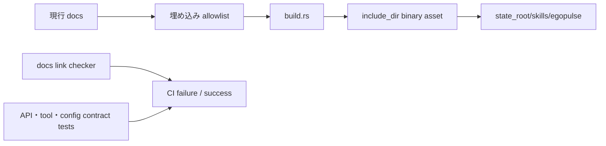

# Built-in Reference ドキュメント整合性 設計・実装計画

## 1. 結論と実現可能性

実装可能であり、効果も大きい。ただし、自由文で書かれたドキュメントとコードの意味的一致を完全自動で判定することは対象にしない。

実装する範囲は次の3つに絞る。

- バイナリへ埋め込むドキュメントを現行リファレンスだけに限定する
- ドキュメント中のローカル実装リンクが壊れていないことを CI で検出する
- API、設定、tool 名など機械的に検証できる重要な契約をテストで検証する

これにより、古い計画書をエージェントへ提供してしまう問題と、存在しない実装ファイルを案内する問題を防ぐ。文章全体の意味検証や LLM による自動レビューは追加しない。

## 2. 現状と課題

[`build.rs`](../../../build.rs) は `docs/` を再帰的に `references/` へコピーし、そのディレクトリを `include_dir` でバイナリへ埋め込む。実行時には [`src/builtin_skills.rs`](../../../src/builtin_skills.rs) が `state_root/skills/egopulse/` へ展開する。

現状のテストは、`SKILL.md` と `architecture.md` が埋め込まれていることを確認するだけである。CI の documentation check は Rust の `cargo doc` だけで、Markdown のリンクや実装との整合性は検査しない。

その結果、次の状態が成立する。

```text
実装ファイルを移動・分割
  -> docs の参照を更新し忘れる
  -> cargo build / cargo doc は成功する
  -> 古い参照を含む docs が Built-in Skill に埋め込まれる
```

実際に `docs/tools.md` には、現行ツリーに存在しない `src/tools.rs` と `src/tools/mcp_adapter.rs` への参照が残っている。

## 3. 設計方針

### 3.1 ソースの種類を分ける

`docs/` には、エージェントが現行実装を理解するためのリファレンスと、開発者向けの履歴・計画が混在している。Built-in Skill に埋め込むのは、明示的に登録した現行リファレンスだけにする。

埋め込み対象の初期リストは次のとおりとする。

```text
docs/architecture.md
docs/commands.md
docs/config.md
docs/channels.md
docs/session-lifecycle.md
docs/tools.md
docs/mcp.md
docs/openai-codex.md
docs/system-prompt.md
docs/security.md
docs/deploy.md
docs/directory.md
docs/db.md
docs/api.md
docs/sleep.md
docs/pulse.md
docs/voice-channel.md
```

`docs/plan/`、`docs/issues/`、`docs/superpowers/`、`docs/microclaw-reference/`、`docs/webui/` は自動埋め込み対象にしない。新しい現行リファレンスを追加する場合は、埋め込みリストと `SKILL.md` の参照表を同じ変更で更新する。

### 3.2 `build.rs` の再帰コピーを allowlist コピーへ置き換える

`build.rs` に埋め込み対象の相対パスを定数として置く。各ファイルについて次を行う。

1. ソースファイルが存在することを build 時に確認する。
2. `references/` 以下へ相対パスを維持してコピーする。
3. `cargo:rerun-if-changed` を対象ファイルにだけ出力する。
4. 対象外の `docs/` 変更では、Built-in Skill の再生成を発生させない。

対象ファイルが欠落している場合は、古いバイナリを作らず build を失敗させる。allowlist と `SKILL.md` の表がずれた場合は、検証テストで検出する。

### 3.3 既存インストールの古い references を残さない

`state_root/skills/egopulse/` は `expand_builtin_skills` が管理する生成ディレクトリであり、ユーザー作成スキルの正本ではない。ユーザー作成スキルは `state_root/workspace/skills/` に置かれる既存契約を維持する。

展開時は生成対象ディレクトリを安全に再構築し、過去の `references/plan/` や `references/issues/` が残らないようにする。`workspace/skills/` は絶対に削除しない。

展開処理が失敗した場合に中途半端な生成物を残さないため、次のいずれかを採用する。

- 生成先の sibling temporary directory へ展開して rename する
- 既存の生成ファイル一覧を manifest で管理し、対象外になったファイルだけ削除する

実装は、ファイル数が少なく失敗時の状態を明確にできる temporary directory 方式を推奨する。rename が利用できない環境では manifest 方式へ切り替える。

### 3.4 CI では機械的なリンク検査だけを行う

依存を増やさず Python 標準ライブラリだけで `scripts/check_docs.py` を追加する。

検査対象は埋め込み対象の現行リファレンスと `SKILL.md` とする。Markdown の相対リンクから fragment を除き、次を検査する。

- 相対リンク先のファイルまたはディレクトリが存在する
- `src/`、`docs/`、`web/` への参照が存在する場合、実体が存在する
- `http://`、`https://`、`mailto:`、見出しだけの `#anchor` は外部参照として検査対象外にする

ルートから実装ファイル名を grep するだけの検査にはしない。Markdown のリンク基準位置を使わないと false positive が多くなるためである。

### 3.5 高価値の契約だけを自動テストにする

自由文の検証ではなく、以下のような機械的な契約を対象にする。

- Built-in Skill に含まれる reference ファイルの一覧
- `/api/*` の主要 route 名
- 設定 API の公開フィールド名
- Built-in tool の登録名
- `docs/SKILL.md` の reference 表に記載されたファイルの存在

実装詳細をドキュメントから逆生成する仕組みや、全 docs を AST 化する仕組みは作らない。

## 4. データフロー



## 5. 非対象

- 自由文の意味的一致を 100% 判定すること
- LLM を利用した docs review の CI 自動化
- 開発計画や issue 文書を削除すること
- `docs/` の全体構成を再編成すること
- ユーザー作成スキルの上書き優先順位を変更すること

## 6. 実装計画

### Step 0: Worktree 作成

- ブランチ名: `refactor/builtin-doc-reference-check`
- 実装を開始する場合は、計画ありの作業として専用 worktree を作成する。
- ドキュメントだけを作成する段階では、現在の worktree を変更しない。

### Step 1: 埋め込み対象を固定する

対象:

- `build.rs`
- `src/assets/builtin-skills/egopulse/SKILL.md`
- `src/builtin_skills.rs`

TDD 項目: `T1`

RED:

- `embedded_reference_set_matches_allowlist` を追加する。
- 対象外の `plan`、`issues`、`superpowers` が埋め込まれている状態では失敗させる。

GREEN:

- `build.rs` の再帰コピーを allowlist コピーへ変更する。
- source が存在しない場合に build error とする。
- `SKILL.md` の reference 表を allowlist に合わせる。

REFACTOR:

- パスの重複を定数へ集約する。
- runtime の展開ロジックに docs 固有の条件分岐を増やさない。

### Step 2: 古い生成 references を置き換える

TDD 項目: `T2`

RED:

- `expand_builtin_skills_replaces_obsolete_references` を追加する。
- 旧バージョンの `references/plan/old.md` を作成してから展開し、展開後に残らないことを検証する。

GREEN:

- 管理対象の temporary directory へ `SKILL.md` と allowlist 参照を展開する。
- 展開成功後に既存の generated directory と置き換える。
- `workspace/skills/` は対象外にする。

REFACTOR:

- rename と cleanup の失敗を `io::Error` として一貫して返す。
- user skill override の既存テストが変わらないことを確認する。

### Step 3: Markdown link checker を追加する

TDD 項目: `T3`

RED:

- 一時 docs を作り、存在しない相対リンクを検出するテストを追加する。

GREEN:

- `scripts/check_docs.py` を標準ライブラリだけで実装する。
- fragment、外部 URL、コード例内の文字列を誤検出しない範囲を定義する。

REFACTOR:

- リンク解決、対象ファイル選択、エラー表示を関数に分離する。
- 失敗時に doc path と解決後 path を表示する。

### Step 4: CI と契約テストへ接続する

TDD 項目: `T4`

実施内容:

- `.github/workflows/ci.yml` に `python scripts/check_docs.py` を追加する。
- Built-in Skill の file set テストを `cargo test` で実行する。
- 主要 route、設定 API、tool 名を検証する既存テストまたは小さな契約テストを追加する。

### Step 5: 現行 docs を修正する

- `docs/tools.md` の存在しない実装リンクを現行ファイルへ更新する。
- `docs/api.md`、`docs/config.md`、`docs/channels.md` の route・設定・channel 参照を checker で確認する。
- `docs/issues/issues.md` の解消済み項目を削除または現行の課題へ更新する。

### Step 6: 検証と自己レビュー

実装後に次を実行する。

```bash
python scripts/check_docs.py
cargo fmt --check
cargo test builtin_skills
cargo test
cargo clippy --all-targets --all-features -- -D warnings
RUSTDOCFLAGS="-D warnings" cargo doc --no-deps
```

自己レビューでは、allowlist にない docs がバイナリに混入していないか、旧生成ファイルが残らないか、user skill を消していないかを確認する。「問題なし」で終了せず、実装と docs の対応を実際に照合してから完了とする。

## 7. テストリスト

| ID | 期待する振る舞い | 優先 | 対応 Step |
|---|---|---:|---:|
| T1 | 埋め込み対象が allowlist と一致し、対象外の計画・issue 文書を含まない | High | Step 1 |
| T2 | 古い generated reference が更新後に残らない | High | Step 2 |
| T3 | 壊れた相対リンクを CI checker が検出する | High | Step 3 |
| T4 | checker と契約テストが CI で実行される | High | Step 4 |
| T5 | user skill override が built-in 更新で失われない | High | Step 2 |
| T6 | 外部 URL や fragment を誤検出しない | Medium | Step 3 |

## 8. 変更ファイル一覧

| ファイル | 変更内容 |
|---|---|
| `build.rs` | docs allowlist による埋め込み |
| `src/builtin_skills.rs` | generated skill tree の安全な置換とテスト |
| `src/assets/builtin-skills/egopulse/SKILL.md` | 現行 reference 表の同期 |
| `scripts/check_docs.py` | Markdown のローカルリンク検査 |
| `.github/workflows/ci.yml` | docs checker の CI 実行 |
| `docs/tools.md` ほか | 現行実装とのリンク整合 |

## 9. コミット分割

1. `build: restrict embedded references to current docs`
2. `test: add built-in reference and docs link checks`
3. `docs: align implementation references`

## 10. 完了条件

- Built-in Skill に埋め込まれる docs が明示的な現行リファレンスだけになっている。
- 古い生成 references が残らない。
- 壊れたローカル実装リンクが CI で検出される。
- 主要な API / config / tool 契約の回帰をテストで検出できる。
- 自由文の完全一致を保証しようとする複雑な仕組みが追加されていない。

## 11. 見積もり

実装量は小〜中程度。主な不確実性は、既存インストールの generated directory を安全に置き換える処理と、現在の docs にある壊れたリンクの修正件数である。意味的一致の自動検出まで要求すると、費用対効果が悪くなり計画が破綻するため、そこは明確に対象外とする。
