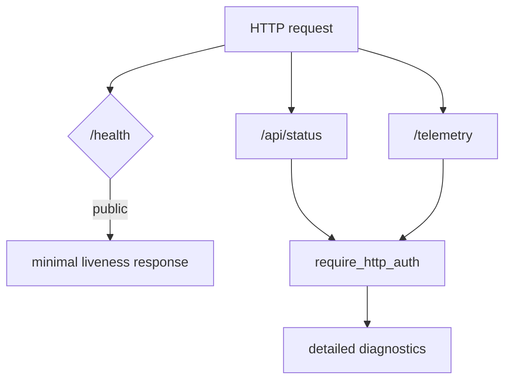

# Health / Telemetry 認証境界 設計・実装計画

## 1. 目的

稼働監視に必要な最小情報は認証なしで取得できる状態を維持しつつ、PID、MCP エラー、channel 状態、recent error、lock 情報などの内部診断情報を認証済み利用者だけに限定する。

## 2. 結論と実現可能性

実装可能であり、変更範囲も限定できる。ポイントは、`/health` を「公開 liveness probe」、詳細 status と telemetry を「認証済み diagnostics」として分離することである。

単純に既存 `/health` 全体へ認証を付けると、systemd や外部監視が壊れる。逆に認証を付けずに残すと、bind host や reverse proxy の構成次第で内部情報が公開される。二つの契約を分けるのが最も無理が少ない。

## 3. 現状の課題

[`src/channels/web/mod.rs`](../../../src/channels/web/mod.rs) では、通常の `/api/*` に `require_http_auth` が付いている一方、`/health` と `/telemetry` はその middleware の外側に mount されている。

現在の `/health` は次の情報を返す。

- PID、version、uptime
- DB、channel、active turn、owned task の状態
- `critical_task_failure`
- channel ごとの `last_error`
- MCP server 名と接続エラー
- instance lock の有無と lock file の絶対パス

`/telemetry` は Prometheus 系メトリクスに加え、recent turn と recent error の詳細を返す。

既存の gateway は認証なしで `/health` と `/telemetry` を取得しているため、ルートへ認証を追加する場合は gateway も同時に変更する必要がある。

## 4. 公開 API と認証 API

### 4.1 公開 liveness probe: `GET /health`

レスポンスは最小限にする。

正常時:

```json
{"ok":true}
```

異常時:

```json
{"ok":false}
```

HTTP status は次のとおりとする。

| 状態 | status |
|---|---:|
| runtime が正常 | `200 OK` |
| DB 不良、shutdown 中、critical task failure、稼働 channel なし | `503 Service Unavailable` |

`/health` は runtime status snapshot だけで判定し、MCP manager の詳細取得や recent error の serialization を行わない。監視用リクエストが内部診断処理に引きずられないようにする。

### 4.2 詳細 status: `GET /api/status`

既存の rich な `HealthResponse` を認証済み endpoint として返す。`channels.web.auth_token` による Bearer 認証を必須にする。

返却してよい情報:

- version、uptime、PID
- DB / channel / task / active turn の状態
- MCP の接続状態と sanitized error summary
- recent error 件数、critical task failure

絶対パスを返す `instance_lock.lock_file` は削除する。lock の有無だけを `held` として返す。絶対パスは systemd やローカルログで確認でき、HTTP API の契約に含める必要がない。

### 4.3 詳細 telemetry: `GET /telemetry`

既存 URL を維持し、認証 middleware の内側へ移す。レスポンスの metrics、recent turns、recent errors は変更しないが、認証なしアクセスは `401 Unauthorized` とする。

raw payload、token、prompt は telemetry に追加しない。MCP / recent error の本文は、既存の sanitized error 方針を通した値だけを返す。

## 5. ルーティング構造



`/api/*` の既存認証 route と同じ middleware 実装を利用する。health 専用の別 token、role、session は追加しない。

## 6. gateway の扱い

`egopulse gateway status` は次の順序で取得する。

1. `/health` を token なしで取得する。
2. 設定から解決した web auth token を `Authorization: Bearer ...` として `/api/status` と `/telemetry` に付ける。
3. 詳細取得が `401`、timeout、JSON parse error のいずれかになった場合は、現在どおり `systemctl status` へ fallback する。

認証 token は log、エラー文字列、status output へ含めない。gateway が設定を読み込めない場合も、最低限の liveness または systemd status は表示できるようにする。

## 7. エラーとセキュリティ境界

| ケース | 動作 |
|---|---|
| `/health` に token なし | liveness を返す |
| `/api/status` に token なし | `401` |
| `/telemetry` に token なし | `401` |
| web auth token 未設定 | 詳細 endpoint は `500 web_auth_not_configured` |
| token 不一致 | `401`、内部状態を返さない |
| MCP status 取得失敗 | 認証済み詳細 endpoint の rich status だけに影響。公開 health は影響させない |

認証は情報漏洩の境界であり、raw error の安全性を不要にするものではない。詳細 endpoint でも lock path、secret、prompt、token は返さない。

将来 TLS、複数ユーザー、role-based access control を追加することは可能だが、この設計には含めない。

## 8. 実装計画

### Step 0: Worktree 作成

- ブランチ名: `fix/protect-runtime-diagnostics`
- 実装を開始する場合は専用 worktree を作成する。

### Step 1: 公開 health を最小化する

TDD 項目: `T1`

RED:

- `public_health_returns_only_liveness_fields` を追加する。
- 認証なしで `ok` 以外が返らないことを検証する。

GREEN:

- `HealthProbeResponse` を追加する。
- `/health` の handler を runtime status の軽量判定だけにする。
- unhealthy 時の HTTP status を `503` にする。

REFACTOR:

- rich status の構築処理と probe 判定を分離する。
- MCP manager を公開 health の経路から外す。

### Step 2: rich status を認証 route へ移す

TDD 項目: `T2`

RED:

- `detailed_status_requires_web_auth` を追加する。
- token なし、誤 token、正しい token の3条件を検証する。

GREEN:

- `/api/status` を追加する。
- 既存 rich health response を `/api/status` handler へ接続する。
- `instance_lock.lock_file` を response から削除し、`held` だけ残す。

REFACTOR:

- `/health` と `/api/status` の response 型名を役割に合わせる。
- auth middleware 以外に credential 判定を増やさない。

### Step 3: telemetry を認証 middleware 内へ移す

TDD 項目: `T3`

RED:

- `telemetry_rejects_unauthorized_requests` を追加する。

GREEN:

- `/telemetry` を protected route group へ移す。
- 正しい token の場合は metrics、recent turns、recent errors を従来どおり返す。

REFACTOR:

- parse / serialization 処理を endpoint の認証処理から分離する。
- response に secret や raw prompt が入らないことを確認する。

### Step 4: gateway と文書を更新する

TDD 項目: `T4`

実施内容:

- `src/runtime/gateway.rs` の詳細 status / telemetry request に Bearer token を付ける。
- unauthorized / timeout 時の systemd fallback を維持する。
- `docs/api.md` と `docs/deploy.md` の endpoint 契約を更新する。
- 外部監視の例は `/health` のみを使うようにする。

### Step 5: config snapshot との整合を確認する

TDD 項目: `T5`

設定 hot reload が先に入る場合、auth middleware と gateway の token 解決が同じ現在 snapshot を参照するようにする。token 変更後、旧 token が受け付けられず、新 token が受け付けられることを確認する。

hot reload 実装が後になる場合でも、web handler が `state.config` と直接結び付かない accessor 境界を用意しておく。

### Step 6: 検証と自己レビュー

```bash
cargo fmt --check
cargo test channels::web::health
cargo test channels::web
cargo test runtime::gateway
cargo test
cargo clippy --all-targets --all-features -- -D warnings
```

自己レビューでは、公開 `/health` に rich field が戻っていないか、`/telemetry` が merge の順序で middleware の外へ出ていないか、gateway が token を log していないかを確認する。

## 9. テストリスト

| ID | 期待する振る舞い | 優先 | 対応 Step |
|---|---|---:|---:|
| T1 | `/health` は認証なしで最小 liveness だけ返す | High | Step 1 |
| T2 | `/api/status` は正しい Bearer token だけを受け付ける | High | Step 2 |
| T3 | `/telemetry` は認証なしで情報を返さない | High | Step 3 |
| T4 | gateway が詳細 endpoint へ token を付け、失敗時に fallback する | High | Step 4 |
| T5 | auth token の snapshot 更新と middleware の参照が一致する | Medium | Step 5 |
| T6 | 公開 response に PID、lock path、MCP error、recent error が含まれない | High | Step 1 |
| T7 | rich response から lock file の絶対パスが除去される | Medium | Step 2 |

## 10. 変更ファイル一覧

| ファイル | 変更内容 |
|---|---|
| `src/channels/web/mod.rs` | route と middleware の境界変更 |
| `src/channels/web/health.rs` | probe / detailed status の分離 |
| `src/runtime/gateway.rs` | protected endpoint の token 送信と fallback |
| `src/channels/web` tests | 認証・公開情報の回帰テスト |
| `docs/api.md` | endpoint 契約の更新 |
| `docs/deploy.md` | 監視・gateway 利用方法の更新 |

## 11. コミット分割

1. `fix: minimize public health response`
2. `fix: protect runtime diagnostics endpoints`
3. `fix: authenticate gateway diagnostics requests`
4. `docs: update health and telemetry contracts`

## 12. 完了条件

- 認証なしの `/health` は安全な最小 probe だけを返す。
- `/api/status` と `/telemetry` は web auth token がないと利用できない。
- gateway status は token を安全に付け、認証失敗時も systemd status へ fallback する。
- 公開 API に PID、lock path、MCP error、recent error が出ない。
- API、deploy docs、テストが新しい境界と一致する。

## 13. 見積もりとリスク

実装量は小〜中程度。主なリスクは gateway と外部監視の契約変更である。`/health` の最小化と詳細 endpoint の追加を同じ変更で行い、deploy docs の curl 例と gateway を同時に更新すれば制御できる。
