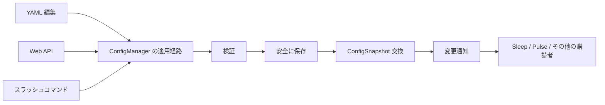

# 設定ホットリロード 実装方針・計画

## 1. 目的

設定ファイルを編集したとき、プロセスを再起動せずに実行中の設定へ反映する。

設定の入口が YAML、Web API、スラッシュコマンドのいずれであっても、同じ検証・保存・反映経路を通す。実行中の Turn は開始時点の設定を保持し、新しく開始する処理だけが新しい設定を使う。

## 2. 現状の課題

- [`ConfigManager`](../../../src/config/manager.rs) は `ConfigSnapshot` をプロセス起動時に1つだけ生成する。`revision` は常に `1` で、実行中の交換処理がない。
- Web の設定 API は YAML を直接読み書きするため、保存成功後も実行中の `ConfigManager` は古い設定を保持する。
- スラッシュコマンドの一部はディスク上の YAML を直接読み、実行処理は `ConfigManager` を読む。表示値と実際の実行値が一致しない経路がある。
- Sleep / Pulse などの長寿命タスクが起動時の設定を保持するため、設定変更には再起動が必要になる。

## 3. 設計方針

### 3.1 設定の責務を `ConfigManager` に集約する

`ConfigManager` を、現在のスナップショットを保持するだけの型から、設定の更新を管理する唯一の窓口へ拡張する。

外部の呼び出し元は、次の操作だけを利用する。

| 操作 | 責務 |
|---|---|
| `current_blocking()` | 現在の不変スナップショットを取得する |
| `apply_candidate(...)` | 検証済み候補を保存し、スナップショットを交換する |
| `reload_from_file()` | YAML を読み込み、同じ適用処理へ渡す |
| `subscribe()` | 設定変更を長寿命タスクへ通知する |

Web API、スラッシュコマンド、ファイル監視処理から `Config::load` や `save_config_with_secrets` を直接呼ばない。秘密値の保存を含め、既存の secret-aware な保存処理は `ConfigManager` 内部から利用する。

### 3.2 更新は「保存成功後にスナップショット交換」とする

更新処理は次の順序で固定する。

1. 候補設定を構築する。
2. YAML の型・値・参照先を検証する。
3. 実行中に変更できない項目が変わっていないことを検証する。
4. 設定ファイルを既存の安全な保存処理で永続化する。
5. 保存成功後に `revision` を1増やした `ConfigSnapshot` と交換する。
6. 変更通知を送る。

保存に失敗した場合も、スナップショット交換に失敗した場合も、古い設定を維持する。途中まで反映された設定を作らない。

更新処理は1つのロックで直列化する。Web API とファイル監視が同時に反映を試みても、片方の候補が静かに上書きすることを許さない。

### 3.3 `watch` による最新値通知を使う

変更通知は全イベントを蓄積するキューではなく、Tokio の `watch` 相当の最新値通知にする。通知内容は設定全体ではなく、`revision` と `fingerprint` だけでよい。受信側は通知後に `current_blocking()` でスナップショットを取得する。

## 4. ホットリロードの対象範囲

### 4.1 反映する設定

- provider と model の選択
- agent の既定値と agent/channel のルーティング
- channel ごとの動作設定のうち、既存 adapter がリクエスト処理時に参照できる値
- Sleep の有効化・間隔・対象設定
- Pulse の有効化・間隔・signal 処理設定
- 既存の設定 API やスラッシュコマンドが変更するその他の実行時設定

### 4.2 再起動が必要な設定

次の項目はプロセスや DB の構築時に決まるため、ホットリロードの対象にしない。

- Web の bind host / port
- `state_root`
- DB のパス、secret DB の有無
- 既存 listener の接続先や bot identity を再接続なしに変更できない channel 接続情報
- 実行中の task 構造を作り直す必要がある設定

再起動が必要な項目が候補に含まれる場合は、候補全体を拒否する。変更可能な項目だけを部分反映しない。YAML 監視経由で拒否した場合は、ファイルを上書きせず、最後に成功したスナップショットを維持してエラーを記録する。

## 5. 実行時の整合性

### 5.1 Turn 単位の設定固定

Turn 開始時に `Arc<ConfigSnapshot>` を1つ取得し、prompt 構築・provider 解決・tool 実行・保存の全過程で同じスナップショットを使う。

- 反映前に開始した Turn は旧設定で完了する。
- 反映後に開始した Turn は新設定を使う。
- Turn の途中で provider や model が切り替わらない。
- `turn_runs.config_revision` と `config_fingerprint` は、実際に使用したスナップショットを記録する。

既に実装されている Turn 単位の snapshot 取得を維持し、処理途中で `ConfigManager` を再読込する経路を追加しない。

### 5.2 provider キャッシュ

provider のキャッシュキーに `revision` または `fingerprint` を含める。設定交換後は新しいキーで provider を生成し、旧 provider の `Arc` は旧 Turn が解放するまで保持する。全 provider を一斉に破棄する仕組みは作らない。

### 5.3 Sleep / Pulse

Sleep と Pulse の長寿命ループは、タイマー待ちと設定変更通知を `select!` で待つ。

設定変更を受けたら、現在のスナップショットから次回実行時刻と有効状態を再計算する。実行中の1回分を強制中断せず、次回実行から新設定を使う。

## 6. 入力経路ごとの動作

### YAML の直接編集

- 設定ファイルそのものではなく親ディレクトリを監視する。安全な一時ファイル置換でも検知できるようにする。
- 200〜500ms 程度の debounce を入れ、連続書き込みを1回の reload にまとめる。
- 自プロセスの保存により発生したイベントは、保存後の fingerprint と比較して無視する。
- parse・validation・非 reloadable 項目検証のいずれかに失敗したら、最後の正常な snapshot を維持する。

### Web API

- GET はディスクではなく `ConfigManager` の現在スナップショットを返す。
- PUT/PATCH は現在の snapshot を基に候補を作り、`apply_candidate` を呼ぶ。
- リクエストに `expected_fingerprint` を持たせ、他の更新を検知した場合は `409 Conflict` にする。
- 保存成功後のレスポンスには `revision` と `fingerprint` を含める。

### スラッシュコマンド

- 設定を変更する既存コマンドは、直接 YAML を保存せず `ConfigManager` の更新処理を呼ぶ。
- `/status` などの表示系は、実行中の snapshot を表示する。
- 設定変更後の処理は Web API と同じ検証・保存・通知経路になる。

## 7. エラーと競合の扱い

| 状況 | 動作 |
|---|---|
| YAML parse / validation 失敗 | 旧 snapshot を維持し、reload error を記録する |
| reload 不可項目の変更 | 候補全体を拒否する |
| 保存失敗 | 旧 snapshot を維持する |
| API の fingerprint 不一致 | `409 Conflict`、保存しない |
| 同一内容の再通知 | fingerprint が同じなら無視する |
| provider 解決失敗 | 候補適用前に検証して拒否する |

秘密値、API token、設定ファイル全文をログに出さない。reload error は設定項目名と固定のエラー分類を中心に記録する。

## 8. 実装計画

### Step 1: `ConfigManager` の更新機能

対象:

- `src/config/manager.rs`
- `src/config/mod.rs`
- 既存の設定保存・検証処理

実施内容:

- 更新直列化用のロックを追加する。
- `apply_candidate`、`reload_from_file`、変更通知を追加する。
- revision を単調増加させる。
- reload 可能項目と不可項目の比較を一箇所に置く。
- 保存成功後だけ snapshot を交換する。

検証:

- 正常更新で revision と fingerprint が変わる。
- 不正設定ではファイルと snapshot が変わらない。
- reload 不可項目を含む候補が全体拒否される。
- 同時更新が直列化され、後勝ちの無言上書きにならない。

### Step 2: Web API とスラッシュコマンドの経路統合

対象:

- `src/channels/web/config.rs`
- `src/slash_commands.rs`
- `src/runtime/mod.rs`

実施内容:

- 直接の load/save を `ConfigManager` 呼び出しへ置き換える。
- GET と `/status` の値を runtime snapshot に統一する。
- fingerprint 競合を API のエラーへ変換する。
- 秘密値保存の責務を manager 内へ移す。

検証:

- API、スラッシュコマンド、manager の各操作が同じ snapshot を更新する。
- API 保存直後に新しい Turn が新設定を使う。
- 実行中の Turn は旧 snapshot を保持する。

### Step 3: YAML watcher と長寿命タスクの購読

対象:

- `src/runtime/` の設定監視起動箇所
- `src/sleep/`
- `src/pulse/`
- provider 解決・cache 箇所

実施内容:

- 親ディレクトリのファイル監視、debounce、自己書き込みの重複排除を追加する。
- Sleep / Pulse を変更通知で再計算する。
- provider cache に snapshot generation を反映する。
- 新しい設定を参照する runtime 読み取りを `ConfigManager` 経由へ統一する。

検証:

- YAML 編集が再起動なしで反映される。
- 不正な YAML を保存しても runtime が停止せず、旧設定で動作する。
- Sleep / Pulse の次回実行が新設定に従う。
- provider / model 変更後の新規 Turn だけが新設定を使う。

### Step 4: ドキュメントと受け入れ確認

- `docs/config.md`、`docs/architecture.md`、必要に応じて `docs/api.md` を実装結果に合わせて更新する。
- `cargo fmt --check`
- `cargo clippy --lib --all-features -- -D warnings`
- 設定 manager、Web API、runtime の対象テスト
- `cargo test`

## 9. 完了条件

- 設定更新経路が `ConfigManager` に一本化されている。
- YAML、Web API、スラッシュコマンドの変更が再起動なしで同じ runtime snapshot に反映される。
- Turn の実行中に設定世代が混ざらない。
- reload 不可項目の変更が部分反映されない。
- 不正な変更で最後の正常設定が失われない。
- Sleep / Pulse と provider cache が新しい snapshot を利用する。
- 設定仕様書と API 仕様書が実装と一致している。
