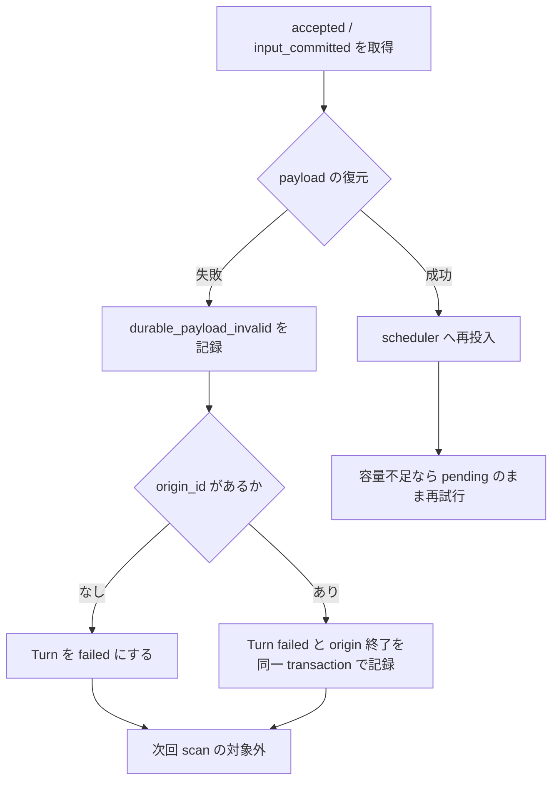

# Durable Turn 復旧失敗処理 実装方針・計画

## 1. 目的

永続化済み Turn の payload が壊れている、または実行バージョンで解釈できない場合に、同じ行を永久に再配送し続ける状態をなくす。

復旧不能な payload は既存の `failed` 状態へ一度だけ遷移させる。DB の新しい状態や管理用テーブルは追加しない。

## 2. 現状の課題

Durable Turn の dispatcher は [`turn_runs.scheduled_request_json`](../../../src/runtime/mod.rs) を読み、[`deserialize_scheduled_turn`](../../../src/agent_loop/mod.rs) で復元する。

現在、復元に失敗した場合は warning を出して次の行へ進むだけで、対象行の状態は `accepted` または `input_committed` のまま残る。そのため、次の dispatcher tick、または次回起動時に同じ行が再び選ばれる。

一方、DB にはすでに次の情報がある。

- `turn_runs.state`
- `scheduled_request_json`
- `error_kind`
- `error_message`
- `origin_id`

また、実行中の失敗を `failed` へ記録する `fail_turn` と、Turn と origin の終了を一つのトランザクションで記録する `fail_turn_and_terminate_origin` が存在する。

## 3. 設計方針

### 3.1 新しい状態・テーブル・カラムを作らない

復旧不能な payload は、既存の `TurnRunState::Failed` で表現する。

- `failed` は「実行を継続できない確定失敗」を表せる。
- dispatcher の検索条件は `accepted` / `input_committed` なので、`failed` にすれば自動的に再配送対象から外れる。
- payload 自体は `scheduled_request_json` に残り、原因調査に使える。
- `quarantined`、`retry_count`、`next_retry_at`、専用 dead-letter テーブルは追加しない。

復旧不能 payload の手動再実行 UI/API は対象外とする。再実行が必要になった場合に raw payload を参照できる状態だけを維持する。

### 3.2 復旧不能と一時障害を分ける

| 事象 | 扱い |
|---|---|
| DB の読み取り失敗 | dispatcher 全体のエラーとして返し、次 tick で再試行する |
| scheduler の容量不足 | 行を維持し、次 tick で再配送する |
| JSON の構文不正 | 対象 Turn を `failed` にする |
| 必須フィールド欠落・型不一致 | 対象 Turn を `failed` にする |
| 未対応の payload version | 対象 Turn を `failed` にする |
| `enqueue_durable_turn` 後の通常実行エラー | 既存の Turn 実行失敗処理に任せる |

JSON の復元エラーは保存済み bytes に対して決定的に発生するため、待っても成功しない。DB 読み取りや scheduler 容量の問題とは別に扱う。

### 3.3 origin の終了まで同時に確定させる

Durable Turn には `origin_id` が保存されている。payload を復元できない Turn が origin の一部である場合、Turn だけを `failed` にすると origin 側に未終了の実行系譜が残る可能性がある。

復元失敗時は次の方針を使う。

- `origin_id` が空なら、既存 `fail_turn` で Turn だけを `failed` にする。
- `origin_id` があるなら、既存 `fail_turn_and_terminate_origin` を使い、Turn の失敗と origin の終了を同一トランザクションで記録する。
- どちらも外部出力を開始する前の失敗なので、`uncertain` にはしない。

終了理由は固定値 `durable_payload_invalid` とし、payload 本文をエラーメッセージやログへ含めない。

## 4. 復旧フロー

dispatcher のページング cursor は従来どおり進める。復元失敗した行をその tick 内で再度読む必要はなく、状態が `failed` になれば次 tick 以降の検索から外れる。

## 5. 保存するエラー情報

既存の列だけを利用する。

| 列 | 値 |
|---|---|
| `state` | `failed` |
| `error_kind` | `durable_payload_invalid` |
| `error_message` | `scheduled durable turn payload is invalid` などの固定・安全な文言 |
| `finished_at` | 既存 `fail_turn` の処理で設定 |
| `scheduled_request_json` | 変更しない |

`error_message` は serde の詳細や JSON 本文をそのまま保存しない。必要な詳細は tracing の分類値に限定し、token、prompt、payload の全文を記録しない。

## 6. 実装計画

### Step 1: DB 側に狭い失敗記録ヘルパーを追加する

対象:

- `src/storage/turn.rs`
- 必要に応じて `src/storage/mod.rs`

実施内容:

- `accepted` / `input_committed` の Durable Turn を対象にした内部ヘルパーを追加する。
- row の現在状態を確認し、すでに terminal なら競合として扱う。
- `origin_id` の有無に応じて `fail_turn` または `fail_turn_and_terminate_origin` を呼ぶ。
- 汎用の `Failed -> Accepted` 遷移や既存 state transition 規則は変更しない。

検証:

- `accepted` が `failed` になる。
- `input_committed` も `failed` になる。
- `origin_id` がある場合、Turn と origin が一つの transaction で終了する。
- 完了済み・キャンセル済み・不確定状態を上書きしない。

### Step 2: dispatcher の復元失敗を terminal failure へ接続する

対象:

- `src/runtime/mod.rs`

実施内容:

- `deserialize_scheduled_turn` の `Err` 分岐で warning のみ出して `continue` する処理を置き換える。
- DB 側の狭い失敗記録ヘルパーを呼び、成功したら次の行へ進む。
- DB 更新に失敗した場合は dispatcher のエラーとして扱い、次 tick で再試行できるようにする。
- payload 本文をログへ出さない。

検証:

- malformed JSON が1回の処理で `failed` になる。
- 未対応 version が `failed` になる。
- 次回の scan で同じ Turn が返らない。
- DB が一時的に失敗した場合は、行を pending のまま次 tick で再試行する。

### Step 3: 観測性を追加する

対象:

- `src/runtime/metrics.rs`
- dispatcher の tracing

実施内容:

- `durable_payload_invalid` の件数を counter で数える。
- log には `turn_id`、scope、固定の error kind だけを含める。
- 既存の durable pending gauge は `failed` へ移った分だけ自然に減ることを確認する。

新しい DB の監視テーブルや履歴保存は追加しない。

### Step 4: ドキュメントと回帰テストを反映する

- `docs/db.md` に、復元不能な Durable Turn は既存 `failed` と `error_kind` で終端化されることを記載する。
- `docs/session-lifecycle.md` または関連する runtime 文書に dispatcher の失敗分類を反映する。
- `cargo fmt --check`
- `cargo clippy --lib --all-features -- -D warnings`
- 対象テストと `cargo test`

## 7. テストケース

### Storage

- `accepted` の row を invalid payload failure にすると `failed` になり、`scan_durable_pending_turns_after` から消える。
- `input_committed` の row も同じように pending から消える。
- `origin_id` 付き row では origin の terminal reason も保存される。
- terminal row への二重 failure は既存の競合エラーになる。
- `scheduled_request_json` は failure 記録後も変更されない。

### Dispatcher

- malformed JSON が再投入されず、1回だけ failure 記録される。
- 未対応 version が再投入されず、1回だけ failure 記録される。
- valid payload は従来どおり scheduler へ渡される。
- scheduler 容量不足では row を `accepted` / `input_committed` のまま残す。
- DB の failure 記録が一時的に失敗した場合、dispatcher が停止せず次の tick へ進める。

### 安全性

- payload 本文、秘密値、prompt がログと `error_message` に含まれない。
- malformed payload の処理で外部 channel への送信や model 呼び出しが発生しない。

## 8. 完了条件

- 復元不能な Durable Turn が dispatcher の無限再試行対象として残らない。
- 一時的な DB 障害や scheduler 容量不足の retry 性質は維持される。
- 既存の `failed`、`error_kind`、`error_message`、origin 終了処理だけで実装され、DB migration が不要である。
- payload の内容を漏らさず、原因を metric と安全なログで把握できる。
- 正常な Durable Turn の復旧動作に変更がない。
