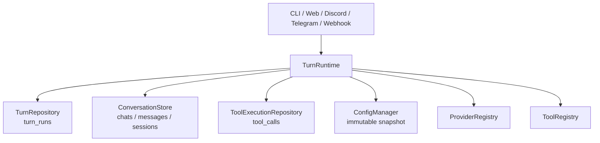

# EgoPulse リポジトリ安定化 Phase 2 作業計画

## 0. 文書情報

| 項目      | 内容                                              |
| ------- | ----------------------------------------------- |
| Phase名称 | Turn実行状態の永続化と安全な再試行                             |
| 前提      | Phase 1完了済み                                     |
| 実装単位    | 単一PR                                            |
| 基準      | Phase 1 merge後の`main`                           |
| 中心課題    | TurnとTool実行の状態を永続化し、重複副作用を起こさずに再試行・復旧判断できるようにする |

---

## 1. 背景と目的

Phase 1では、Turn全体の自動retry、scopeの暗黙fallback、無制限queue、future schemaへの書込み、検証前Releaseなど、異常時に状態を悪化させる挙動を停止した。

その結果、EgoPulseは異常時に安全側へ停止できるようになった。一方で、一時的なLLM障害が発生したTurnを安全に再試行する仕組みや、プロセス停止後にTurnの途中状態を判断する仕組みはまだ存在しない。

現在は、実行中のTurnについて次の情報をDBから一意に判断できない。

* 同じ入力がすでに受付済みか
* user inputが会話履歴へ保存済みか
* LLM呼び出しが開始済みか
* assistant出力やTool Callが外部へ公開済みか
* Toolが未実行、実行中、成功、失敗のどの状態か
* Tool成功後、結果保存前にプロセスが停止した可能性があるか
* TurnがどのConfig世代を使用していたか
* 再試行しても副作用が重複しないか

Phase 2では、全面的なEvent Sourcingを導入するのではなく、既存の永続モデルを活かしながら、TurnとTool実行に不足している状態だけを追加する。

目的は次の3点である。

1. Turnの受付・保存・実行・完了状態をDBから判断できるようにする。
2. LLM retryとcrash recoveryを、重複副作用が発生しない境界に限定する。
3. 1つのTurnが、開始時に固定した同一世代のConfig、Provider、Prompt、Tool Policyを使用するようにする。

### 1.1 Phase 2が解消する問題

| 問題              | 現在の制約                           | Phase 2の解決                        |
| --------------- | ------------------------------- | --------------------------------- |
| 同一入力の重複受付       | 入力単位の永続的な識別子がない                 | `turn_runs.request_key`で重複を防止する   |
| Turnの再開位置が不明    | Turn全体の成功・失敗しか残らない              | `turn_runs`状態機械を永続化する             |
| Toolの再実行可否が不明   | `tool_output`の有無だけでは実行途中を判別できない | 既存`tool_calls`へ実行状態を追加する          |
| Tool成功後の重複実行    | crash位置によって成功済みToolを再実行する可能性がある | 成功結果を再利用し、不明な実行は`uncertain`で停止する  |
| LLM一時障害から回復できない | Phase 1でTurn全体retryを停止した        | 副作用前の同一model iterationだけretryする   |
| 会話順序が時刻依存       | `timestamp, id`は因果順序を厳密には表さない   | chat単位の整数`seq`を導入する               |
| CASが時刻依存        | `updated_at`文字列を競合判定に使用している     | chat単位の整数`revision`へ移行する          |
| Config世代が混在し得る  | 起動時Configと実行時再読込が混在する           | Turn開始時にimmutable snapshotを固定する   |
| Turn内部の依存が広い    | 多数の関数が`AppState`へ直接依存する         | `TurnRuntime`と狭いrepository境界を抽出する |

### 1.2 Phase 2の完了状態

* すべての新規Turnが`turn_id`と`request_key`を持つ。
* 同じ受付入力から複数のTurnやuser messageが作成されない。
* Turnの現在状態を`turn_runs`から判断できる。
* 同一chat内のメッセージ順序がDB発行の整数`seq`で決まる。
* 会話更新の競合判定に整数`revision`を使用する。
* Tool Callが`turn_id + tool_call_id`で一意になる。
* 成功済みToolは保存済み結果を再利用し、自動再実行しない。
* 実行結果を判断できないToolは`uncertain`として停止する。
* LLM retryは、外部出力もTool実行も発生していない同一model iterationに限定される。
* Turn開始後のConfig変更は、そのTurnへ混入しない。
* Turn実行の中心処理が巨大な`AppState`を直接参照しない。

---

## 2. 設計判断

### 2.1 全面Event Sourcingは導入しない

Phase 2では、以下の新規テーブルを導入しない。

* `conversation_streams`
* `conversation_events`
* `model_invocations`
* 新規の`tool_execution_ledger`
* Config snapshot履歴テーブル

会話、Turn、Tool実行は、それぞれ既存モデルまたは最小限の新規モデルで管理する。

| 情報                         | 正本                 |
| -------------------------- | ------------------ |
| user／assistant／systemの会話記録 | `messages`         |
| LLMへ渡す圧縮済み会話snapshot       | `sessions`         |
| Turnのライフサイクル               | 新規`turn_runs`      |
| Tool CallとTool実行状態         | 拡張した既存`tool_calls` |
| chatの順序・競合制御               | 拡張した既存`chats`      |

同じ事実を汎用eventと既存tableの両方へ重複保存しない。

### 2.2 新規テーブルは原則`turn_runs`のみ

TurnはメッセージやSessionとは異なるライフサイクルを持つため、新しい永続モデルとして追加する。

一方、Tool実行台帳は既存`tool_calls`を拡張して実現する。Tool表示用tableと実行台帳を分離し、同じTool Callを二重管理してはならない。

実装中に追加テーブルが必要と判断しても、この計画を変更せず独断で追加しない。必要性、既存tableでは表現できない理由、追加後の正本を明示して計画を改訂する。

### 2.3 exactly-onceを過大に主張しない

SQLite内部の更新はtransactionによって一度だけcommitできる。

一方、外部API、Shell、任意ファイル操作では、次の順序を完全には原子的にできない。

```text
外部副作用が成功
    ↓
EgoPulseが結果をDBへ保存
```

この間でプロセスが停止した場合、外部副作用が発生したかをEgoPulseだけでは判別できない。

判別できない場合は自動再実行せず、ToolとTurnを`uncertain`として停止する。

自動再試行を許可するのは、Toolが明示的にidempotentであり、同じidempotency keyによる重複排除を保証できる場合に限る。

### 2.4 自動回復より安全な停止を優先する

再開条件を証明できない場合は、自動的に推測して処理を続けない。

* Config世代を復元できない
* Toolの実行結果が不明
* partial outputをすでに公開した
* 同じTool Call IDに異なるinputが渡された
* 保存済み状態と現在の処理が矛盾する

これらは`failed`または`uncertain`として停止し、識別可能な理由を保存する。

---

## 3. 対象外

以下はPhase 3以降で扱う。

* Webhook／Channel入力そのもののdurable job queue化
* Runtime全体のstructured concurrency
* Runtime Supervisorとgraceful shutdown
* 外部Channelへのresponse delivery保証
* Sleep MemoryファイルとDBの原子的generation protocol
* Shell／File ToolのOS sandbox
* Discord／TelegramのInbound Policy全面統合
* `AppState`の完全なComposition Root化
* 過去Config snapshotの永続保存
* 任意時点への会話状態復元
* event replayによる全projection再構築
* 全面的なEvent Sourcing

Phase 2では、Turn開始後の永続状態を扱う。Turnを起動する前の入力が、プロセス停止後も必ず残ることまでは保証しない。

---

## 4. 目標アーキテクチャ



### 4.1 主要コンポーネント

| コンポーネント                   | 責務                                                      |
| ------------------------- | ------------------------------------------------------- |
| `TurnRuntime`             | Turn作成、依存固定、状態遷移、model/tool loop、復旧判断                   |
| `TurnRepository`          | `turn_runs`の作成、重複受付防止、状態遷移、失敗理由保存                       |
| `ConversationStore`       | message順序発行、revision CAS、messageとsession snapshotの原子的更新 |
| `ToolExecutionRepository` | Tool claim、状態更新、input整合確認、結果再利用、uncertain判定             |
| `ConfigManager`           | Config検証、revision／fingerprint発行、snapshotのatomic swap    |
| `ProviderRegistry`        | Config snapshotに対応したProvider解決とcache管理                  |
| `ToolRegistry`            | Tool定義、Tool Policy、idempotency分類の提供                     |

---

## 5. Work Package 1 — Minimal Durable Schema

### 5.1 目的

TurnとTool実行の状態を永続化し、会話順序と競合制御を時刻依存から整数へ移行する。

### 5.2 新規`turn_runs`テーブル

最低限、次の情報を保持する。

| 列                    | 意味                                 |
| -------------------- | ---------------------------------- |
| `turn_id`            | Turn一意ID、PK                        |
| `chat_id`            | 対象conversation                     |
| `request_key`        | 同一受付の重複防止key                       |
| `state`              | Turn状態                             |
| `current_iteration`  | 現在のmodel loop位置                    |
| `input_message_id`   | user input message                 |
| `final_message_id`   | 最終assistant message                |
| `config_revision`    | Turn開始時のConfig revision            |
| `config_fingerprint` | Config内容の識別hash                    |
| `model_request_hash` | 現在iterationの固定request hash         |
| `model_attempt`      | 現在iterationの試行回数                   |
| `output_published`   | delta、narration、Tool Call等を外部公開済みか |
| `error_kind`         | 最終失敗分類                             |
| `error_message`      | sanitized error概要                  |
| `accepted_at`        | 受付時刻                               |
| `updated_at`         | 最終更新時刻                             |
| `finished_at`        | 完了・停止時刻                            |

一意制約：

```text
UNIQUE(chat_id, request_key)
```

同じ`chat_id + request_key`を再受付した場合、新しいTurnを作成せず既存Turnを返す。

### 5.3 Turn状態

最低限、次の状態を定義する。

```text
accepted
input_committed
model_pending
model_completed
tools_pending
tools_completed
completed
failed
cancelled
uncertain
```

状態遷移はRust enumと中央定義したtransition ruleで管理する。任意のmoduleから自由文字列で状態を更新してはならない。

許可されていない状態遷移はDB更新前に拒否する。

### 5.4 `chats`の拡張

次を追加する。

| 列                  | 意味                          |
| ------------------ | --------------------------- |
| `revision`         | 会話変更ごとに増加する整数CAS            |
| `next_message_seq` | 次に発行するchat内message sequence |

* `revision`と`next_message_seq`は同一transaction内で更新する。
* `timestamp`は監査・表示用として残す。
* 順序やCAS判定にwall clockを使用しない。

### 5.5 `messages`の拡張

次を追加する。

| 列                   | 意味                        |
| ------------------- | ------------------------- |
| `seq`               | chat内の単調増加sequence        |
| `turn_id`           | 所属Turn                    |
| `parent_message_id` | Tool Result等が参照する親message |

制約：

```text
UNIQUE(chat_id, seq)
```

既存の`message_kind`と`sender_kind`は維持する。会話メッセージを汎用JSON eventへ置き換えない。

### 5.6 `sessions`の拡張

次を追加する。

| 列                      | 意味                                 |
| ---------------------- | ---------------------------------- |
| `snapshot_through_seq` | `messages_json`へ反映済みの最終message seq |

`updated_at`は監査時刻として残すが、競合判定には使用しない。

Session更新時は、呼出元が期待する`chats.revision`と一致した場合だけ、次の処理を同一transactionで行う。

1. messageのinsert
2. 必要なsession snapshotの更新
3. `snapshot_through_seq`の更新
4. `chats.revision`のincrement
5. `chats.next_message_seq`の更新

### 5.7 既存`tool_calls`の拡張

次を追加する。

| 列                   | 意味                   |
| ------------------- | -------------------- |
| `turn_id`           | 所属Turn               |
| `state`             | Tool実行状態             |
| `input_hash`        | canonical inputのhash |
| `idempotency_class` | 再実行可能性の分類            |
| `idempotency_key`   | Toolが対応する場合の重複排除key  |
| `started_at`        | 実行開始時刻               |
| `finished_at`       | 完了時刻                 |
| `error_kind`        | 失敗分類                 |
| `error_message`     | sanitized error概要    |

一意制約：

```text
UNIQUE(turn_id, id)
```

Tool状態：

```text
pending
running
succeeded
failed
uncertain
```

既存の`tool_output`は成功結果の保存に引き続き使用する。

### 5.8 migration

migration前にDB backupを作成する。backupに失敗した場合、migrationを開始しない。

既存データは次の規則で移行する。

#### `messages`

* `chat_id`ごとに`timestamp ASC, id ASC`で安定ソートする。
* 先頭から`seq`を連番で割り当てる。
* 既存messageの`turn_id`はNULLを許容する。
* `chats.next_message_seq`は既存最大seq + 1とする。
* `chats.revision`は初期値を設定する。

#### `sessions`

* 現在の`messages_json`をそのまま保持する。
* `snapshot_through_seq`は、そのchatの既存最大seqを初期値とする。
* 既存LLM contextを再構築し直さない。

#### `tool_calls`

* `tool_output`が存在する既存行は`succeeded`とする。
* `tool_output`が存在しない既存行は、実行結果を推測せず`uncertain`とする。
* 既存行の`turn_id`はNULLを許容する。
* legacy行を自動retry対象にしない。

### 5.9 検証

* fresh DBで新schemaが作成される。
* 既存DB migration後もWeb historyとLLM contextが変化しない。
* migration再実行でseqやTurnが重複しない。
* 同一chatへの並行更新で、一方だけがexpected revisionに成功する。
* 同一timestampのmessageでも`seq`順が決定的である。
* future schema guardが維持される。
* backup失敗時にschema変更が始まらない。

---

## 6. Work Package 2 — ConversationStoreへの書込み集約

### 6.1 背景

schemaを追加しても、各moduleが`messages`と`sessions`を独立して更新し続ければ、順序・revision・snapshot整合性を保証できない。

一方で、すべてを汎用eventへ変換する必要はない。

### 6.2 実装方針

会話変更を`ConversationStore`へ集約する。

最低限、次の操作を提供する。

* user inputのcommit
* assistant messageのcommit
* system messageのcommit
* Tool message／Tool Resultのcommit
* compaction後のsession snapshot更新
* 現在のconversation snapshot読込
* expected revision付き更新
* message seqの発行

各操作は用途別の型付きAPIとし、自由な`kind + payload_json`形式にはしない。

### 6.3 transaction境界

messageとLLM session snapshotの両方を変更する操作は、同一SQLite transactionでcommitする。

* messageだけ成功してsession更新が失敗する状態を許容しない。
* sessionだけ進みmessageが残らない状態を許容しない。
* expected revisionが一致しない場合、全体をrollbackする。
* 競合時は最新snapshotを再読込して判断する。
* 同じ入力を無条件に再appendしない。

### 6.4 読取り方針

* LLM contextは引き続き`sessions.messages_json`を使用する。
* Web historyは`messages`を`seq`順で読む。
* Sleep入力は`messages`を`seq`順で読む。
* Tool Cardは`messages`と`tool_calls`を関連付けて構築する。
* Session一覧の最終message判定も`seq`を使用する。

Phase 2では、毎回`messages`からLLM contextを全面再構築しない。

### 6.5 直接writeの撤去

少なくとも次のmoduleから、`messages`または`sessions`への独立writeを撤去する。

* `src/agent_loop`
* `src/channels/web`
* Discord／TelegramのTurn保存経路
* compaction処理
* Tool Resultの会話保存経路

Channel Logなどsessionを持たないmessageについても、`ConversationStore`内の専用APIを通す。

### 6.6 検証

* user messageとsession snapshotが原子的に更新される。
* assistant messageとsession snapshotが原子的に更新される。
* message insert失敗時にsnapshotだけ進まない。
* snapshot更新失敗時にmessageだけcommitされない。
* revision conflict時に部分更新が残らない。
* Web、Sleep、Session一覧が`seq`順で一貫する。
* feature moduleから旧DB write APIへの直接依存が残らない。

---

## 7. Work Package 3 — Durable Turn State and Safe Retry

### 7.1 受付と重複防止

各Ingressは、可能な限り安定した`request_key`を生成する。

| Ingress    | request_key候補                          |
| ---------- | -------------------------------------- |
| Discord    | channel／thread／platform message ID     |
| Telegram   | chat ID／platform message ID            |
| Web        | client request IDまたはuser message ID    |
| Webhook    | receiver ID／外部event ID。存在しない場合は受付時UUID |
| CLI／TUI    | 1回の明示入力ごとにUUID                         |
| Agent間Turn | origin ID／派生元Turn ID／派生sequence        |

同じ`chat_id + request_key`を再受付した場合は、既存Turnの状態を返す。

既存Turnが`completed`なら保存済み最終結果を利用する。実行中なら新しい実行を開始しない。

### 7.2 Turn開始

`TurnRuntime::start_turn`は、次の順序で処理する。

1. Config snapshotを取得する。
2. `turn_runs`を作成または既存Turnを取得する。
3. user inputが未保存なら、同じTurn内で一度だけ保存する。
4. `input_committed`へ遷移する。
5. model iterationを開始する。

`turn_runs`作成とuser input保存を無関係な別処理として扱わない。

### 7.3 model iteration

model iteration開始時に、少なくとも次を固定する。

* Provider
* Model
* System Prompt
* 会話messages
* Tool definitions
* Tool Policy
* request payload hash
* Config revision／fingerprint
* iteration番号

`model_request_hash`は、retry時に同じrequestであることを確認するために使用する。

### 7.4 自動retry条件

LLM retryを許可するのは、すべての条件を満たす場合だけとする。

* 同じTurnである。
* 同じiterationである。
* `model_request_hash`が一致する。
* assistant deltaを外部へ公開していない。
* narrationを外部へ公開していない。
* Tool Callを外部へ公開していない。
* assistant messageをcommitしていない。
* Tool実行を開始していない。
* errorが明示的にretryableである。
* Config snapshotが同一である。

対象errorの例：

* HTTP 429
* HTTP 5xx
* 接続失敗
* 読取りtimeout
* response受信前の一時的network error

retry回数とbackoffには上限を設ける。

### 7.5 retry禁止条件

次のいずれかに該当する場合、自動retryしない。

* partial outputを外部へ公開済み
* Tool Callを受信・保存済み
* Tool実行開始済み
* response eventまたはassistant messageをcommit済み
* request hashが一致しない
* Config fingerprintが一致しない
* providerが結果を返した可能性を否定できない
* errorのretryabilityが不明

この場合は`failed`または`uncertain`へ遷移する。

### 7.6 recovery

起動時または同じTurnの再受付時に、永続状態から処理を判断する。

| 状態                | 処理                                    |
| ----------------- | ------------------------------------- |
| `accepted`        | input未保存なら同じTurnで保存する                 |
| `input_committed` | Config整合を確認しmodel開始可能                 |
| `model_pending`   | 外部出力・Tool実行がなくrequest hash一致ならretry可能 |
| `model_completed` | 保存済みresponse／Tool Callから続行する          |
| `tools_pending`   | `tool_calls`の状態を確認する                  |
| `tools_completed` | 次model iterationまたはfinalizeへ進む        |
| `completed`       | 保存済み結果を返し、新規実行しない                     |
| `failed`          | 明示的な再実行操作がない限り自動再開しない                 |
| `uncertain`       | 自動再開しない                               |
| `cancelled`       | 自動再開しない                               |

### 7.7 response deliveryの扱い

Phase 2の`completed`は、最終結果がDBへ保存されたことを意味する。

Discord、Telegram、WebSocket等への外部配信が必ず一度だけ成功したことまでは意味しない。

外部Channelへのdurable deliveryと再送制御はPhase 3の対象とする。

### 7.8 検証

* 同じrequest keyを2回受付してもTurnが1件である。
* 同じrequest keyを2回受付してもuser messageが1件である。
* completed Turnの再受付でLLMを呼ばない。
* LLM 429／5xx／network errorを安全条件内でretryできる。
* partial delta公開後はretryしない。
* Tool Call保存後はTurn全体をretryしない。
* Config不一致の未完了Turnは自動再開しない。
* 不正なTurn状態遷移を拒否する。

---

## 8. Work Package 4 — Existing Tool Calls as Execution Ledger

### 8.1 背景

既存`tool_calls`はTool名、入力、出力を保持しているが、実行前、実行中、成功、失敗、結果不明を区別できない。

Phase 2では新しいledger tableを追加せず、既存`tool_calls`をTool実行の正本へ拡張する。

### 8.2 Tool claim

Tool実行前に、`ToolExecutionRepository::claim`を呼び出す。

claimは次を原子的に行う。

1. `turn_id + tool_call_id`で既存行を検索する。
2. 未登録なら`pending`として作成する。
3. canonical inputを生成し、`input_hash`を保存する。
4. 既存行とinput hashが異なる場合はconflictにする。
5. 実行可能なら`running`へ遷移する。
6. `started_at`を保存する。

Tool実行を先に行い、後から台帳行を作成してはならない。

### 8.3 保存済み状態の扱い

| Tool状態      | 実行規則                        |
| ----------- | --------------------------- |
| `pending`   | claim後に実行可能                 |
| `running`   | 通常実行中。recovery時は結果不明として扱う   |
| `succeeded` | 保存済み`tool_output`を返し、再実行しない |
| `failed`    | policyが許可しない限り自動再実行しない      |
| `uncertain` | 自動再実行しない                    |

### 8.4 idempotency分類

Tool定義に次のいずれかを明示する。

```text
read_only
idempotent
non_idempotent
```

* `read_only`：外部状態を変更しない。
* `idempotent`：同じidempotency keyで重複排除できる。
* `non_idempotent`：再実行で副作用が重複する可能性がある。

未指定Toolは`non_idempotent`として扱う。

名称だけからread-onlyやidempotentと推測しない。

### 8.5 crash recovery

プロセス起動時またはTurn再開時に`running`のToolが残っていた場合、原則`uncertain`へ遷移する。

例外として、次をすべて満たす場合のみ自動retryを許可する。

* Toolが`read_only`または`idempotent`
* 同じcanonical input
* 同じinput hash
* 同じidempotency key
* Tool実装がそのkeyによる重複排除を保証する
* retry policyが明示的に許可する

### 8.6 Tool結果の保存

Tool成功時は、次を同一transactionで更新する。

* `state = succeeded`
* sanitized `tool_output`
* `finished_at`
* error情報のclear

Tool失敗時は次を保存する。

* `state = failed`
* `error_kind`
* sanitized `error_message`
* `finished_at`

Tool outputやerrorへsecretを保存する前に、既存sanitizerを通す。

### 8.7 検証

* 同じ`turn_id + tool_call_id`を二重作成しない。
* 同じcall IDでinput hashが異なる場合は拒否する。
* succeeded Toolは保存済み結果を返す。
* succeeded Toolを再実行しない。
* running Toolはrecovery時にuncertainになる。
* non-idempotent Toolをuncertainから自動再実行しない。
* 明示的にidempotentなToolだけ同じkeyでretryできる。
* Tool success後のLLM失敗でToolを再実行しない。
* Tool結果と状態が部分commitされない。

---

## 9. Work Package 5 — Versioned ConfigManager

### 9.1 背景

現在は、起動時に保持したConfigと、実行時にファイルから再読込する経路が混在している。

そのため、1つのTurn内で次のような世代混在が起こり得る。

* Providerは新Config
* Promptは旧Config
* Tool Policyは旧Config
* Secret registryは新Config
* context windowは旧Config

Phase 2では、Turn開始時にConfig依存を一度だけ解決し、Turn完了まで固定する。

### 9.2 Config分類

全設定fieldを、次のいずれかへ分類する。

| 分類      | 例                                                                       | 変更時の扱い                |
| ------- | ----------------------------------------------------------------------- | --------------------- |
| Boot    | state root、DB path、listener、channel process topology、Secret DB topology | restart required      |
| Live    | Agent profile、model選択、Prompt、compaction、表示policy                        | 次Turnから反映             |
| Rebuild | Provider credential、base URL、Tool Policy、routing、secret registry        | 新snapshotを構築・検証後にswap |

未分類fieldを残さない。

### 9.3 `ConfigSnapshot`

snapshotは少なくとも次を含む。

* 単調増加`revision`
* 内容から算出した`fingerprint`
* validated config
* Agent設定
* Provider解決情報
* Prompt catalog
* Tool definitions
* Tool Policy
* compaction policy
* Secret registry
* Channel routing policy

ConfigManagerは、新しい設定と依存関係をすべて構築・検証できた場合だけsnapshotをatomic swapする。

途中まで設定を反映してはならない。

### 9.4 Turnでの固定

Turn開始時に`Arc<ConfigSnapshot>`を取得し、Turn完了まで保持する。

Turn内部からConfigファイルを同期再読込しない。

`turn_runs`にはsnapshotの`revision`と`fingerprint`を保存する。

### 9.5 プロセス再起動後の扱い

Phase 2では過去Config snapshotそのものをDBへ保存しない。

未完了Turnを再開する際は、現在Configのfingerprintと`turn_runs.config_fingerprint`を比較する。

| 条件             | 扱い                          |
| -------------- | --------------------------- |
| fingerprint一致  | 他の再開条件を満たせば再開可能             |
| fingerprint不一致 | 自動再開せず`uncertain`           |
| Config不正       | 現在snapshotを維持し、新Turnにも反映しない |

Configが変わっていても、似た設定だと推測して再開しない。

### 9.6 Provider cache

* cache keyにConfig revisionまたはfingerprintを含める。
* 使用中TurnのProviderは`Arc`で保持する。
* credential変更後の新Turnが旧Provider instanceを使用しない。
* 古いrevisionの未使用entryを削除できるようにする。

### 9.7 検証

* Config変更中のTurnは旧snapshotだけを使用する。
* 変更後のTurnは新snapshotを一式使用する。
* 不正Configは一部反映されない。
* 不正Configでrevisionが進まない。
* Boot field変更はrestart requiredになり、現在Runtimeを変更しない。
* credential変更後、新Turnが旧Providerを利用しない。
* Turn実行経路にConfigファイル同期読込が残らない。
* 再起動後、fingerprint不一致のTurnを自動再開しない。

---

## 10. Work Package 6 — TurnRuntime and Partial AppState Decomposition

### 10.1 背景

現在のTurn処理は、DB、Config、Provider、Tool、Channel、Scheduler、Memory、Status等を保持する`AppState`へ広く依存している。

この状態では、Turn開始時にConfigを固定しても、別経路が`AppState`から最新Configや別Providerを直接取得する可能性がある。

### 10.2 抽出する境界

```text
TurnRuntime
├── ConfigManager
├── ConversationStore
├── TurnRepository
├── ToolExecutionRepository
├── ProviderRegistry
└── ToolRegistry
```

`TurnRuntime::start_turn`は次を担当する。

1. Config snapshot取得
2. Turn作成または既存Turn取得
3. Conversation revision取得
4. Turn用依存の固定
5. 状態機械の実行
6. recovery判断
7. final state保存

### 10.3 `TurnDependencies`

1つのTurnが必要とする固定済み依存だけを保持する。

最低限：

* `Arc<ConfigSnapshot>`
* resolved Agent profile
* resolved Provider
* resolved Prompt
* resolved Tool definitions／policy
* conversation identity
* Turn identity
* Config revision／fingerprint

Channel process、Sleep scheduler、Runtime全体のstatusなどを無条件に含めない。

### 10.4 移行範囲

Phase 2で対象とする。

* Agent loopのTurn実行
* Provider／Model解決
* Prompt構築
* Tool loop
* Tool result保存
* session snapshot更新
* compactionによるconversation更新
* Turn state更新

Phase 2終了時、Turn実行の中心処理は`&AppState`ではなく、`TurnRuntime`またはさらに狭いtrait／repositoryを受け取る。

### 10.5 対象外

`AppState`自体は残してよい。

Phase 2では、Application起動時に`TurnRuntime`を組み立てるComposition Rootの一部として扱う。Runtime全体の完全分解はPhase 3へ送る。

### 10.6 検証

* Turn executorが`AppState`を直接参照しない。
* Conversation永続化が`ConversationStore`以外から行われない。
* Turn状態更新が`TurnRepository`以外から行われない。
* Tool状態更新が`ToolExecutionRepository`以外から行われない。
* Config revisionとfingerprintがTurnへ記録される。
* narrow dependencyを使ったTurn unit testが、Runtime全体を構築せず実行できる。
* CLI、TUI、Web、Discord、Telegram、Webhookが同じ`TurnRuntime`へ到達する。

---

## 11. Work Package 7 — Cutover and Compatibility Verification

### 11.1 目的

新旧実行モデルを長期間併存させず、Phase 2完了時に新しいTurn実行経路へ切り替える。

既存tableは引き続き使用するが、旧APIと新repositoryが同じ情報を別々に更新する状態を残さない。

### 11.2 cutover条件

* すべての新規Turnが`turn_runs`を持つ。
* すべての新規messageがchat内`seq`を持つ。
* すべての会話変更が`ConversationStore`を経由する。
* すべてのTool実行が拡張`tool_calls`をclaimしてから始まる。
* Session CASが`updated_at`ではなく整数`revision`を使用する。
* Turn途中のConfig再読込がない。
* Web historyとSleep sourceが`seq`順で動作する。
* legacy DBを移行して既存sessionを継続できる。
* migration前にbackupが作成される。
* rollbackできない条件が文書化される。

### 11.3 version contract

既存のversion fieldを「読み取るだけ」で残さない。

* Pulse definitionのversionを対応versionとして検証する。
* 未対応versionは実行せず、識別可能なerrorを返す。
* versionを使用しない設計ならfield自体を削除する。
* `#[allow(dead_code)]`で未使用versionを残さない。
* DB schema version、Pulse definition version、Config revisionを別概念として文書化する。

### 11.4 統合シナリオ

1. 既存DBを移行し、既存Web／Discord／Telegram sessionを継続する。
2. user → LLM → final responseを実行し、message、session、Turn状態を照合する。
3. user → LLM → Tool → LLM → final responseを実行し、Tool状態とTurn状態を照合する。
4. 同じ入力を二重受付し、Turnとuser messageが増えないことを確認する。
5. LLM request前にcrash相当状態を作り、再開できることを確認する。
6. LLM response受信前のretryable errorから安全にretryできることを確認する。
7. partial streaming後にerrorを発生させ、自動retryしないことを確認する。
8. Tool claim後、実行前にcrash相当状態を作る。
9. Tool実行後、結果保存前にcrash相当状態を作り、`uncertain`になることを確認する。
10. Tool成功保存後、次のLLM呼び出しで失敗させ、Toolを再実行しないことを確認する。
11. Config reloadとTurn実行を並行させ、1 Turn内で世代混在しないことを確認する。
12. 未完了Turnを残してConfigを変更し、再起動後に自動再開しないことを確認する。
13. 同一chatへ並行入力し、revision conflictから重複なしで収束することを確認する。
14. 各transaction境界でfailure injectionし、部分commitが残らないことを確認する。

---

## 12. 実装順序

単一PR内で、次の順序で実装する。

### Package 1：Schemaとmigration

* `turn_runs`追加
* `chats`、`messages`、`sessions`、`tool_calls`拡張
* legacy backfill
* migration前backup
* migration test

### Package 2：RepositoryとConversationStore

* `TurnRepository`
* `ConversationStore`
* `ToolExecutionRepository`
* integer revision／message seq
* 既存DB APIからの移行

### Package 3：Tool実行台帳化

* Tool claim
* input hash
* state transition
* result reuse
* uncertain recovery
* idempotency分類

### Package 4：Durable TurnとSafe Retry

* request key
* Turn state machine
* model request hash
* retry条件
* recovery処理
* completed結果再利用

### Package 5：ConfigManager

* Config分類
* immutable snapshot
* atomic swap
* revision／fingerprint
* Provider cache分離
* Turn途中再読込撤去

### Package 6：TurnRuntimeとcutover

* Turn依存固定
* Agent loop移行
* 各Ingress統一
* 旧write経路撤去
* 統合テスト
* ドキュメント更新

各Package完了時に関連testを通し、最後にまとめて修正する進め方にしない。

---

## 13. 完了条件

* [ ] 新規テーブルが原則`turn_runs`だけに限定されている。
* [ ] `conversation_events`と`conversation_streams`を導入していない。
* [ ] すべての新規Turnが`turn_id`と`request_key`を持つ。
* [ ] 同じrequest keyでTurnとuser messageが重複しない。
* [ ] Turn状態がDBへ永続化されている。
* [ ] `messages`がchat内の整数`seq`を持つ。
* [ ] 会話CASが整数`revision`を使用している。
* [ ] `sessions.updated_at`をCASとして使用していない。
* [ ] 既存`tool_calls`がTool実行台帳として拡張されている。
* [ ] succeeded Toolの結果を再利用できる。
* [ ] running Toolをrecovery時に`uncertain`へ移せる。
* [ ] non-idempotent Toolを自動再実行しない。
* [ ] LLM retryが同一iterationの安全条件内に限定されている。
* [ ] partial output公開後に自動retryしない。
* [ ] Tool成功後のLLM失敗でToolを再実行しない。
* [ ] Config snapshotがTurn単位で固定されている。
* [ ] Config fingerprint不一致のTurnを自動再開しない。
* [ ] Turn実行経路からConfigファイル同期再読込がなくなっている。
* [ ] Turn executorが`AppState`を直接参照しない。
* [ ] Conversation writeが`ConversationStore`へ集約されている。
* [ ] Tool状態更新が`ToolExecutionRepository`へ集約されている。
* [ ] legacy DB migration後も既存sessionとWeb historyを継続できる。
* [ ] migration前backupが実装されている。
* [ ] Pulse definition versionが検証されている。
* [ ] Phase 3対象のdurable ingress、Supervisor、sandboxを混在させていない。

---

## 14. Phase 3への引継ぎ

Phase 2完了後、EgoPulseはTurn開始後の状態を永続的に追跡できる。

* 同じ入力の二重処理を防げる。
* 安全な範囲のLLM retryが可能になる。
* 成功済みToolの再実行を防げる。
* Tool実行結果が不明な場合に安全に停止できる。
* Config世代をTurn単位で固定できる。
* Turn実行をRuntime全体から分離した境界ができる。

一方、次の問題は残る。

* Turn受付前の入力はプロセス停止で失われ得る。
* 外部Channelへのresponse deliveryはdurableではない。
* background taskの所有権とshutdown順序は統一されていない。
* Sleep MemoryのDB／file更新は原子的ではない。
* ToolのOS権限は制限されていない。

Phase 3では、Phase 2で確立した`TurnRuntime`、`TurnRepository`、`ConversationStore`、Tool実行台帳を前提に、次を扱う。

* Runtime Supervisor
* Durable Ingress Queue
* Durable Response Delivery
* Structured Concurrency
* Graceful Shutdown
* Sleep Runtimeとgeneration protocol
* Tool Sandbox
* Channel Gateway
* `AppState`分解の完了
