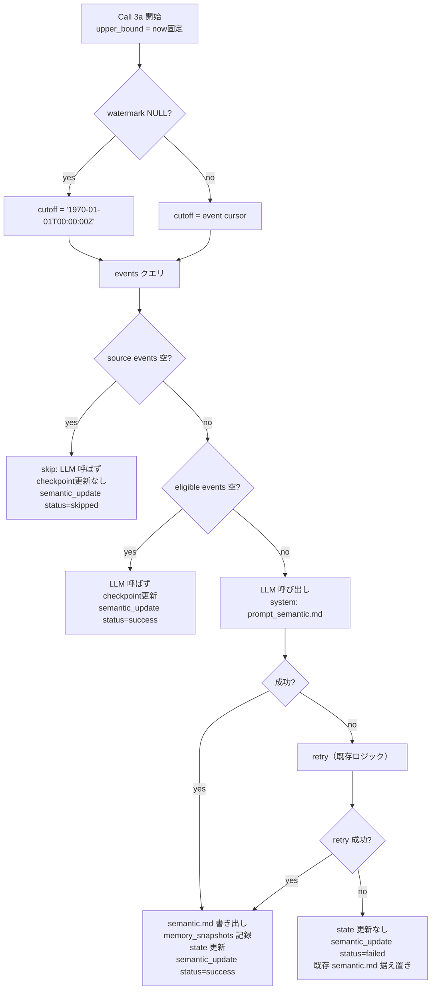
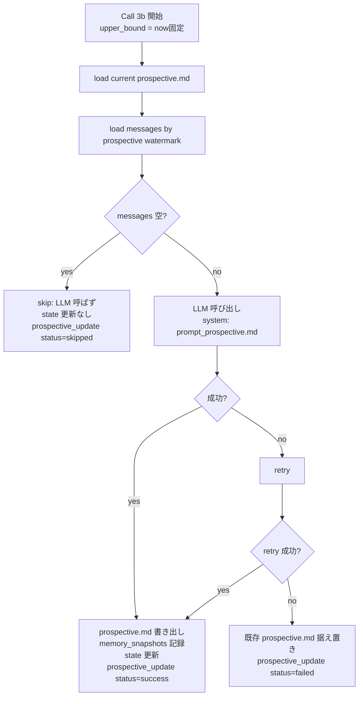

# Sleep Batch Call 3 再設計（Semantic / Prospective）

Sleep Batch の Call 3 を、責務の異なる 2 つのサブコールに分割する設計書。
Call 1/Call 2/Episodic Renderer には触らない。

## 目次

1. [概要](#1-概要)
2. [動機](#2-動機)
3. [設計原則](#3-設計原則)
4. [Call 3a: Semantic](#4-call-3a-semantic)
5. [Call 3b: Prospective](#5-call-3b-prospective)
6. [`prospective.md` フォーマット](#6-prospectivemd-フォーマット)
7. [完了フロー（TODO → Event）](#7-完了フローtodo--event)
8. [失敗時挙動](#8-失敗時挙動)
9. [50件 cap](#9-50件-cap)
10. [既存 Call への影響](#10-既存-call-への影響)
11. [未解決 / 保留](#11-未解決--保留)

---

## 1. 概要

### Before（現状）

```
Call 3 (Memory Update)
  入力: sessions + episodic.md + semantic.md + prospective.md
  出力: { semantic, prospective }  ← 1 回の LLM 呼び出しで両方を生成
  プロンプト: 8 ステップの "海馬" 比喩
```

### After（再設計後）

```
Call 3a (Semantic)
  入力: semantic.md + 直近 ripple >= 3 の episode_events
  出力: 更新後 semantic.md
  プロンプト: 抽象化・スキーマ照合・重複排除

Call 3b (Prospective)
  入力: prospective.md + prospective watermark 以降の raw conversation
  出力: 更新後 prospective.md
  プロンプト: TODO 検出・完了検出・ライフサイクル管理
```

### 効果

- **責務分離**: 抽象化（semantic）と状態管理（prospective）を 1 回の LLM 呼び出しで混在させない
- **入力最適化**: semantic は構造化 events を、prospective は raw conversation を — それぞれ natural な source を直接使える
- **skip 最適化**: Call 3a は入力 events が空なら LLM 呼ばない。イベント密度が低い日は自然に no-op
- **失敗粒度**: 「semantic だけ失敗」「prospective だけ失敗」が独立に記録される

---

## 2. 動機

現状の Call 3 で観測される問題：

| 問題 | 詳細 |
|---|---|
| 入力の混在 | 1 回の LLM 呼び出しに sessions + episodic + semantic + prospective の 4 種類を全部入れる。プロンプトが肥大 |
| 抽象化と状態管理の混在 | 「スキーマ照合して principle 抽出」と「TODO 追加/削除」を同時にやらせる。認知的に別物 |
| スキーマ照合が LLM 任せ | 「既存 principle と一致するか」を全 text スキャンで判断 → 重複 principle が蓄積 |
| 50件 cap が LLM 任せ | LLM が「50件超えたら削れ」を雰囲気で判断 → 効かない |
| retrospective delay | 完了した TODO がエピソードイベントになるまでに 1 サイクル lag |
| 入力 cutoff の不明確さ | 「何を見て更新したか」が DB に残らない |

---

## 3. 設計原則

### 原則 1: 入力は source に忠実

- **semantic の source は episode_events（構造化済み）** → 会話ログを再投入しない
- **prospective の source は raw conversation** → 構造化すると intention 萌芽を取りこぼす

### 原則 2: 出力は最小

- Call 3a は `semantic.md` 1 ファイル
- Call 3b は `prospective.md` 1 ファイル
- 両者を 1 回の LLM 呼び出しで同時に生成しない

### 原則 3: watermark は state table に

「どこまで処理したか」は `sleep_step_checkpoints`（agent × step × source 単位 state）に保存する。log テーブル（`sleep_runs`）で代用しない。run 全体が `partial_failure` でも、成功済みstepのcheckpointは進める。

### 原則 4: best-effort は維持

各 Call は独立に失敗しうる。失敗しても run 全体は止まらない。DB上では対応する `sleep_run_steps` の step に個別 status を記録する。

### 原則 5: skip は積極的に

入力が空なら LLM を呼ばない。watermark も更新しない（再評価が正しく動くように）。

---

## 4. Call 3a: Semantic

### 責務

> **ripple >= 3 の新規 episode_events を semantic.md に反映する。スキーマ照合・重複排除・抽象化を担当。**

### 入力

| ソース | 内容 | 取得条件 |
|---|---|---|
| `sleep_step_checkpoints` | event checkpoint | `step_name='semantic_update'`, `source_kind='episode_events'` で取得。行なしなら未処理 |
| `episode_events` | checkpoint以降の events | `(encoded_at, id) > checkpoint AND encoded_at <= upper_bound`。取得後に `ripple_strength >= 3` を候補化 |
| `semantic.md` (file) | 現在の semantic.md | mtime チェック後 load |

### 出力

| 出力先 | 内容 |
|---|---|
| `semantic.md` (file) | 更新後の全文（LLM 生成） |
| `memory_snapshots` | before / after スナップショット |
| `sleep_run_steps` (`step_name='semantic_update'`) | status, tokens, error, metadata_json |
| `sleep_step_checkpoints` | 成功時にのみevent cursorを入力範囲の末尾へ更新 |

### 処理フロー



### skip 条件

- checkpointより後のsource eventsが空
- skip 時は LLM 呼び出しなし、`sleep_step_checkpoints` 更新なし、`memory_snapshots` 作成なし
- ただし `sleep_run_steps` の `step_name='semantic_update'` 行は `status='skipped'` へ更新する
- source eventsはあるが`ripple >= 3`の候補がない場合は`success`（no change）とし、checkpointを進める

### watermark 更新ルール

| 状況 | semantic event checkpoint |
|---|---|
| skip（入力空） | **しない** |
| success（no change含む） | 入力 events の末尾 `(encoded_at, id)` に更新 |
| retry 失敗 | **しない**（次回 run で再投入） |

`upper_bound` は Call 3a 開始時点で固定する。入力クエリは複合cursor `(encoded_at, id)` より後、かつ `encoded_at <= upper_bound` とし、LLM実行中に追加されたeventを誤って処理済みにしない。

### LLM 入力プロンプト（`prompt_semantic.md`、新設）

設計要件：
- role: 「あなたは知識管理者。既存 knowledge に新規 events を照合し、semantic.md を更新せよ」
- 入力: current semantic.md + 新規 events（JSON 配列）
- 出力: 更新後 semantic.md 全文（Markdown 文字列）
- 制約:
  - 12,000 トークン以内
  - 既存 principle との重複は統合
  - 矛盾する event は "⚠️ 矛盾" として明示
  - 個別出来事への言及（「X さんが Y したとき...」型の記述）は禁止
  - 秘密情報を含めない

---

## 5. Call 3b: Prospective

### 責務

> **raw conversation から新規 TODO を抽出し、既存 prospective.md と照合して完了済み TODO を除去する。**

### 入力

| ソース | 内容 | 取得条件 |
|---|---|---|
| `sleep_step_checkpoints` | chat別message checkpoint | `step_name='prospective_update'`, `source_kind='messages'`, `source_id=chat_id` で取得 |
| `messages` | checkpoint 以降の raw conversation | chatごとに `(timestamp, id) > checkpoint AND timestamp <= upper_bound` |
| `prospective.md` (file) | 現在の prospective.md | mtime チェック後 load |

### 出力

| 出力先 | 内容 |
|---|---|
| `prospective.md` (file) | 更新後の全文（LLM 生成） |
| `memory_snapshots` | before / after スナップショット |
| `sleep_run_steps` (`step_name='prospective_update'`) | status, tokens, error, metadata_json |
| `sleep_step_checkpoints` | 成功時にのみchat別message cursorを入力範囲の末尾へ更新 |

### watermark 更新ルール

Call 3b も `sleep_runs.finished_at` ではなく `sleep_step_checkpoints` をcutoff正本として使う。理由は、run全体が`partial_failure`でもCall 3b単体の成功範囲をchat別に保持し、次回runで同じraw conversationを重複投入しないため。

| 状況 | prospective message checkpoint |
|---|---|
| skip（入力 conversation 空） | **しない** |
| 成功 | chatごとに入力 messages の末尾 `(timestamp, id)` へ更新 |
| retry 失敗 | **しない**（次回 run で再投入） |

`upper_bound` はCall 3b開始時点で固定する。入力クエリはchat別の複合cursor `(timestamp, id)` より後、かつ `timestamp <= upper_bound` とし、LLM実行中に追加されたmessageを誤って処理済みにしない。

### 処理フロー



### skip 条件

- 入力 conversation が空（watermark より新しく、かつ `upper_bound` 以下の message がない）
- skip 時は LLM 呼び出しなし、`sleep_step_checkpoints` 更新なし、`memory_snapshots` 作成なし
- ただし `sleep_run_steps` の `step_name='prospective_update'` 行は `status='skipped'` へ更新する
- conversationはあるがTODO変更がない場合は`success`（no change）とし、chat別checkpointを進める

### LLM 入力プロンプト（`prompt_prospective.md`、新設）

設計要件：
- role: 「あなたは TODO 管理者。既存 TODO リストと最近の会話を照合し、未完了 TODO のみ残せ」
- 入力: current prospective.md + recent conversation
- 出力: 更新後 prospective.md（プレーン箇条書き）
- 制約:
  - 完了済み TODO は **必ず削除**（done 項目を残さない）
  - 会話に明示的な commitment があれば新規追加
  - 50件超えそうなら古い/曖昧な順に削る
  - メタデータ（[P3], @日付 等）は付けない。ただし期限・対象Issue・対象PRなど、TODO本文の意味に必要な情報は自然文として残す
  - 秘密情報を含めない

---

## 6. `prospective.md` フォーマット

### Before（現状）

```markdown
# Prospective

## Pending
- [ ] ドキュメント整理 @2026-06-01 P3
- [ ] Pulse と Sleep の接続
- [ ] Issue #XX を解決

## Done (last 7 days)
- [x] (2026-05-20) 仕様書レビュー完了
```

→ "done" セクションあり、メタデータあり。

### After（再設計後）

```markdown
# Prospective

- ドキュメント整理
- Pulse と Sleep の接続
- Issue #XX を解決
```

→ **プレーン箇条書きのみ**。done 項目は存在しない。メタデータなし。

### 理由

- **done は別の場所で表現される**: episode_events の `kind="feat"` / `kind="decision"` として残る
- **固定メタデータは冗長**: 優先度・期限は `[P3]` や `@date` のような固定スキーマにしない。ただし「明日まで」「Issue #XX」など TODO の意味に必要な情報は本文に残す
- **LLM にとって最も書きやすい形式**: 箇条書きをそのまま出力するだけ

### 変更点

- 「Done」セクション廃止
- 固定メタデータ（`@date`, `P1..P5`, `[ ]` vs `[x]`）廃止
- 箇条書きの先頭記号は `-` 固定

---

## 7. 完了フロー（TODO → Event）

### シナリオ

prospective.md に `- Pulse と Sleep の接続を実装` がある。User が翌日「Pulse と Sleep の接続、ひとまず実装できた」と話す。

### 次の Sleep Batch 内の動き

```
Sleep Batch (同日)
  │
  ├─ Call 1 (Event Extraction)
  │    raw conversation を読む
  │    → "Pulse と Sleep の接続を実装" を kind="feat", ripple=4 の event として抽出
  │    → episode_events テーブルに INSERT
  │
  ├─ Call 2 (Episodic View)
  │    （既存通り、events から rollup 生成）
  │
  ├─ Call 3a (Semantic)
  │    （この example では関連 events が ripple >= 3 なら semantic 昇格候補）
  │
  └─ Call 3b (Prospective)
       raw conversation を読む（Call 1 と同じ chunk）
       → "Pulse と Sleep の接続、実装できた" を認識
       → prospective.md から `- Pulse と Sleep の接続を実装` を削除
```

### 結果（同 run 内）

- `episode_events` に "feat" event が増える
- `prospective.md` から該当 TODO が消える
- **lag なし**。同じ conversation chunk を 2 つの Call が別目的で読むだけ
- Call 3b 成功時にchat別のprospective checkpointが進む。run全体が`partial_failure`でも、このconversation chunkは次回Call 3bに重複投入しない。

### 設計上の重要性

「完了した TODO」の状態は MD 上に存在しない。代わりに **「events に新規行がある」** ことで表現される。prospective.md には **常に未完了の TODO だけ**がある。

---

## 8. 失敗時挙動

### 各 Call の失敗時

| Call | 失敗時 |
|---|---|
| Call 3a | semantic.md据え置き。semantic event checkpointを更新しない（次回再投入）。`step_name='semantic_update'`を`failed`にする |
| Call 3b | prospective.md据え置き。prospective message checkpointを更新しない（次回再投入）。`step_name='prospective_update'`を`failed`にする |

### retry ロジック

既存 Call 1/2 と同じ retry ロジックを適用（`JSON_RETRY_GUARD` 等）。retry 失敗時の挙動も他 Call と同じ（既存ファイル据え置き、`sleep_run_steps` に failed 記録）。

### run 全体の status

`sleep_runs.status` の決定：
- 全 Call が success または skipped で、少なくとも 1 つ success → `success`
- 1 つ以上 failed かつ 1 つ以上 success → `partial_failure`
- 全 Call failed、または Call 実行前の致命的失敗 → `failed`
- run 終了時に pending / running の Call が残っている → `failed`
- 全 Call skipped → `skipped`

cutoff は `sleep_runs.status` ではなく `sleep_step_checkpoints` を正本にする。これにより、run 全体が `partial_failure` でも成功済み Call の処理済み範囲は次回へ引き継げる。

---

## 9. 50件 cap

### 現状

`prompt.md` Step 6 に「pending が50件を超えた場合、古いものから見直しする」と書かれているが、**LLM 任せで Rust 側 enforce なし**。

### 再設計後の合意

- **当面**: 引き続き LLM 任せ。Rust 側 enforce なし
- **将来的な候補**: 件数チェック → 超えてたら LLM に "X 件削って" と再呼び出し
- **判断保留**: 運用で「LLM が 50 件超えを制御できているか」を観察してから判断

### LLM への指示（`prompt_prospective.md` 内）

```
出力する TODO の総数は 50 件を超えないこと。
超えそうな場合は、古い順または曖昧な順に削ること。
```

---

## 10. 既存 Call への影響

### Call 1 (Event Extraction)

処理内容は変更しない。引き続き:
- raw conversation → episode_events
- retry ロジック同じ
- `sleep_run_steps` の `step_name='event_extraction'` 行を新設（v7 マイグレーションで追加）

ただしcutoffは`sleep_runs.status='success'`ではなく、`sleep_step_checkpoints`に保存されたchat別のEvent Extraction cursorを使う。これにより、Call 1は成功したがCall 3aだけ失敗してrunが`partial_failure`になった場合でも、次回runで同じraw conversationを重複抽出しない。

### Call 2 (Episodic View)

**変更なし**。引き続き:
- episode_events → episode_rollups → episodic.md
- `sleep_run_steps` の `step_name='episodic_update'` 行を新設

### Episodic Renderer

**変更なし**。Rust 側で `episodic.md` を組み立てる pure logic。LLM 不在。

### Sleep Scheduler

**変更なし**。Sleep Batch の trigger 周りは触らない。

### `MemoryContent` 構造体（`src/memory.rs`）

**一部変更**: 今は `episodic`, `semantic`, `prospective` の 3 フィールドだが、Call 3a/3b で個別に更新するため、保持する構造は同じでも更新フローが変わる。`MemoryContent` 自体は流用可能。

---

## 11. 未解決 / 保留

### Q1: Call 3a skip 時に `memory_snapshots` を作るか

入力空で LLM 呼ばないとき、`memory_snapshots` に「変更なし」の行を入れるかどうか。

- **現状の合意**: 入れない。before/after とも空 or 同値。`sleep_run_steps` の status='skipped' で十分。
- **代替案**: 入れる場合、content_before = content_after = 既存 semantic.md。**冗長**。

### Q2: Call 3a 失敗時の retry で何 token 消費したか

retry 1 回目、retry 2 回目…の token を合算して `step_name='semantic_update'` の `input_tokens` に入れるか、**最後の attempt だけ**を入れるか。

- **現状の合意**: 既存 Call 1/2 と同じ挙動（合算）。`memory_update.rs::send_sleep_request` を参考。
- **要確認**: 既存実装の合算ロジックを確認して合わせる。

### Q3: `prompt_prospective.md` での「完了検出」の精度

raw conversation から「これは前の TODO が完了した」と LLM が判断する精度。

- **期待**: ユーザー発言に明示的な "X 終わった / 完了 / できた" があれば高確率で検出
- **不安**: 暗示的な完了（「X のテスト書いて」→ 実装は終わってた？）を取りこぼす可能性
- **対策**: LLM には conservative な判定を指示。「明示的に完了と言及されていない限り削除しない」

### Q4: Semantic checkpoint cursor

詳細は [sleep-tables.md § Q3](./sleep-tables.md#q3-checkpoint-cursor-の構成) を参照。

### Q5: Prospective checkpoint の粒度

詳細は [sleep-tables.md § Q4](./sleep-tables.md#q4-message-checkpoint-の粒度) を参照。

---

## 関連ドキュメント

- [sleep.md](./sleep.md) — Sleep Batch 全体仕様（Call 1/2/Renderer 含む）
- [sleep-execution-model.md](./sleep-execution-model.md) — Sleep Batch の実行意味論
- [sleep-tables.md](./sleep-tables.md) — 関連 DB テーブルの責務分離
- [db.md](./db.md) — DB スキーマ全般
