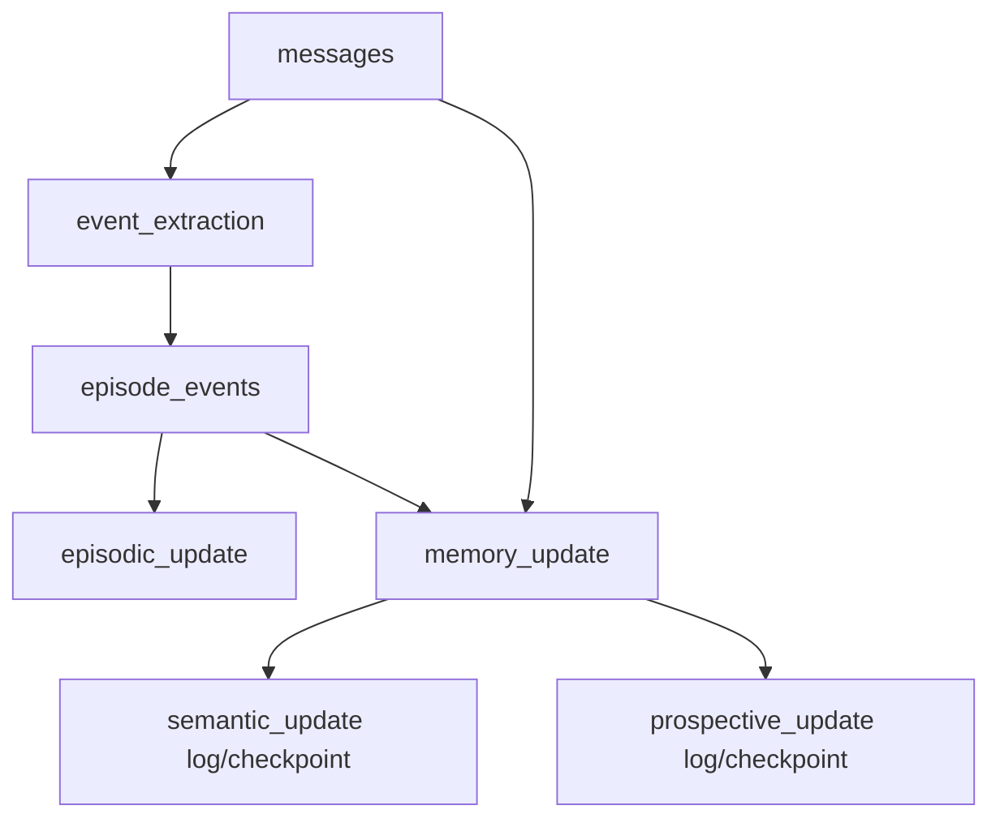

# Sleep Batch 実行モデル

Sleep Batch の実行単位、step 間の依存関係、成功条件、失敗時挙動、checkpoint 更新、run 集約 status を定義する。

本書を Sleep Batch の実行意味論の正本とする。Call 3 を Semantic / Prospective に分割する案は将来構想であり、現在の実行モデルには含めない。

## 1. 目的

Sleep Batch を step の集合として扱い、各 step が処理した入力範囲と結果を明確にする。次回入力の開始位置は run 全体の status ではなく、step ごとの checkpoint から決定する。

ただし Semantic Update と Prospective Update は、論理的な記録を分けたまま、1 回の Memory Update として実行する。両者を独立した LLM 呼び出しにはしない。

## 2. 基本原則

### 2.1 Step ごとに処理結果を記録する

Event Extraction、Episodic Update、Memory Update は best-effort で順に実行する。前段の失敗だけを理由に、利用可能な入力を持つ後段を中止しない。

Memory Update は `semantic_update` と `prospective_update` の2行を使用するが、実行単位は1つである。両行は同時に開始し、同じ terminal status へ同時に確定する。

### 2.2 Run status を cutoff に使わない

`sleep_runs.status` は監視と一覧表示のための集約情報である。入力範囲は `sleep_step_checkpoints` から決定する。

- message consumer: chat ごとの `(timestamp, id)`
- event consumer: agent ごとの `(encoded_at, id)`

時刻が同じ行を欠落させないため、cursor は必ず時刻とIDの複合値で扱う。LLM 実行中に追加された行を処理済みにしないよう、各実行の入力取得時に upper bound を固定する。

### 2.3 Success は出力と checkpoint の確定を意味する

```text
出力の永続化
+ 必要な snapshot の保存
+ checkpoint の更新
+ step status の成功確定
= step success
```

DB 内の snapshot、checkpoint、step status は同じ transaction で確定する。Memory file は先に atomic replace で公開し、その後のDB確定に失敗した場合は旧内容へ復元する。

### 2.4 Skip と Failure を分ける

- `skipped`: checkpoint 以降に source 行がなく、処理を開始する必要がない
- `failed`: 入力があり、処理を試みたが完了できなかった
- `success (no change)`: 入力を正常に検査したが、永続化する内容に変化がなかった

`success (no change)` では checkpoint と step status を確定するが、Memory file の置換と snapshot 作成は行わない。

## 3. 実行 step

| `step_name` | 実行単位 | 主な入力 | 主な出力 |
|---|---|---|---|
| `event_extraction` | Event Extraction | `messages` | `episode_events` |
| `episodic_update` | Episodic Update | `episode_events`, `episode_rollups` | `episode_rollups`, `episodic.md` |
| `semantic_update` | Memory Update の論理行 | `episode_events`, `semantic.md` | `semantic.md` |
| `prospective_update` | Memory Update の論理行 | `messages`, `prospective.md` | `prospective.md` |

`semantic_update` と `prospective_update` は別々の物理 step ではない。1 回の LLM 呼び出しへ両方の入力を渡し、`semantic.md` と `prospective.md` を同時に生成する。

## 4. 依存関係と実行順序



通常の実行順は次の通り。

```text
event_extraction
→ episodic_update
→ memory_update (semantic_update + prospective_update)
```

Event Extraction が失敗しても、既存の未処理 event または未処理 message があれば後続を実行する。

## 5. Step status

| status | 意味 |
|---|---|
| `pending` | run に登録済み、未開始 |
| `running` | 実行開始済み、結果未確定 |
| `success` | 出力、checkpoint、step log の確定が完了 |
| `failed` | 実行を試みたが確定できなかった |
| `skipped` | checkpoint 以降に source 行がない |

状態遷移は `pending → running → success / failed / skipped` に限定する。

Memory Update の2行は常に同じ状態遷移を行う。片方だけ `success`、もう片方だけ `failed` という状態は作らない。

## 6. Step 別の挙動

### 6.1 Event Extraction

入力は `event_extraction` の chat 別 message checkpoint より後、固定した upper bound 以下の message とする。

成功時は、抽出した event、各 chat の checkpoint、`event_extraction` の success を同じ transaction で確定する。message が存在して event が0件だった場合も success とし、checkpoint を進める。

source message がなければ skipped とする。LLM または parse error が1 chunk でも発生した場合は step 全体を failed とし、event と checkpoint を確定しない。

### 6.2 Episodic Update

必要な週次・月次 rollup を更新し、`episodic.md` を生成する。更新対象期間がなければ skipped とする。

成功確定は次の順で行う。

1. rollup を冪等に upsert する
2. 更新後の `episodic.md` を生成する
3. Memory file を atomic replace する
4. episodic snapshot と step success を同じDB transactionで確定する

途中で失敗した場合は step を failed とし、`episodic.md` を更新しない。ファイル公開後のDB確定に失敗した場合は、公開前の Memory file を復元する。

### 6.3 Memory Update

Memory Update は次の入力を1回のLLM呼び出しへ渡す。

- `semantic_update` の event checkpoint より後の `episode_events`
- `prospective_update` の chat 別 message checkpoint より後の `messages`
- 現在の `semantic.md`
- 現在の `prospective.md`

出力は更新後の `semantic.md` と `prospective.md` である。両方を同じ応答から取得し、部分成功として扱わない。

両 source が空なら、`semantic_update` と `prospective_update` を同時に skipped とする。いずれかに入力があれば Memory Update を実行し、成功時は次を同じDB transactionで確定する。

- 変更があった Memory file の snapshot
- semantic event checkpoint
- prospective message checkpoint
- `semantic_update` と `prospective_update` の success

出力内容が既存ファイルと同じ場合は success (no change) とし、checkpoint だけを進める。失敗時は両 logical step を failed とし、両 checkpoint を進めない。

## 7. Run status

`sleep_runs.status` は `sleep_run_steps` の最終 status から導出する。

| run status | 条件 |
|---|---|
| `success` | 全 step が `success` または `skipped` で、1つ以上 `success` |
| `partial_failure` | 1つ以上 `failed` かつ1つ以上 `success` |
| `failed` | 1つ以上 `failed` かつ `success` が0件、または未完了 step が残る |
| `skipped` | 全 step が `skipped`、または step 開始前に実行不要と判定 |

run status は次回入力範囲に影響しない。

## 8. Session archive

会話を入力に使う全 consumer が処理済みの範囲だけを archive / clear できる。

```text
archive boundary
= chat ごとの min(
    event_extraction message cursor,
    prospective_update message cursor
  )
```

どちらかの checkpoint が存在しない場合は、その session を clear しない。session の最新 message が boundary より後なら clear しない。

現在の session 保存形式は部分 clear を持たないため、session 全体が boundary 以下に収まる場合だけ archive / clear する。archive 失敗は成功済み step を巻き戻さない。

## 9. リトライと再実行

- `success`: checkpoint より後だけを処理する
- `failed`: checkpoint を進めず、同じ入力範囲を再試行する
- `skipped`: 新規 source 行が追加されるまで再度 skipped になり得る
- `pending` / `running`: 異常終了として回収し、checkpoint から再試行する

Memory Update は再実行時も1つの実行単位である。一方の source だけが未処理でも、現在の両 Memory file を入力し、両 logical step を同じ status へ確定する。

## 10. 監査とトークン集計

`sleep_run_steps` は step 別 status、error、token の監査ログであり、`sleep_runs` はその集約である。

Memory Update は1回の物理 LLM 呼び出しなので、token を重複計上しない。使用量は `semantic_update` 行へ記録し、`prospective_update` 行は0とする。run の token は step 値の合計から算出する。
